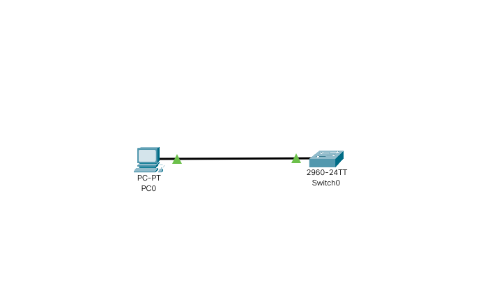
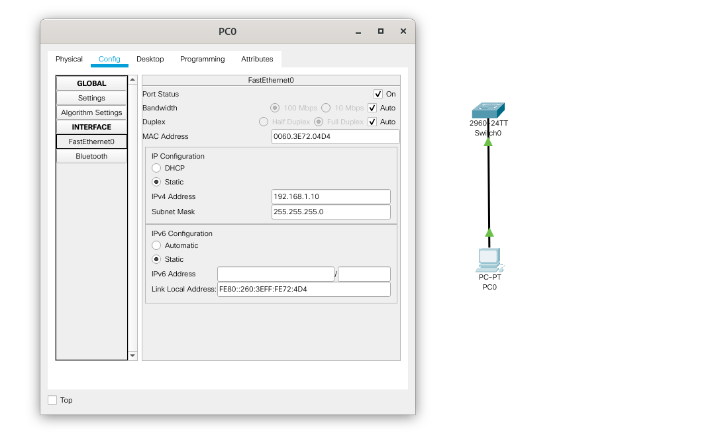

# Лабораторная работа №1. Базовая настройка коммутатора.

###  Задание:

1. Проверка конфигурации коммутатора по умолчанию.

2. Создание сети и настройка основных параметров устройства

 2.1. Настройка базовых параметров коммутатора. 

 2.2. Настройка IP-адреса для ПК.

3. Проверка сетевых подключений

 3.1. Отображение конфигурации коммутатора.

 3.2. Тестирование сквозного соединения отправкой эхо-запроса.

 3.3. Тестирование возможности удаленного управления с помощью Telnet.

###  Решение:

####  1. Проверка конфигурации коммутатора по умолчанию:

 1.1. Подсоединение консольного кабеля к консольному порту коммутатора и COM (USB) порту PC.

 1.2. Запуск программы эмулятора терминала на PC и установка терминального соединения. 

 1.1. Проверка, что все настройки коммутатора удалены и загрузочная конфигурация отсутсвует:

   1.1.1. Проверка отсутствия файла vlan.dat в энергонезависимой NVRAM-памяти, в котором содержатся сведения о VLAN c 0 по 1000. В случае наличия этого файла его необходимо удалить:

```
Switch> enable
Switch# show flash
...
...
 6 -rwx 616 Mar 1 1993 00:07:13 +00:00 vlan.dat
Switch# delete vlan.dat
```
   1.1.2. Удаление загрузочной конфигурации:
```
Switch> enable
Switch# erase startup-config
```
   1.1.3. Перезагрузка коммутатора и отказ от загрузки диалога начального конфигурирования
```
Switch# reload
Would you like to enter the initial configuration dialog? [yes/no]: no
Switch>
```
   1.1.4. Проверка, что старые настройки были действительно удалены:
```
Switch> enable
Switch# show running-config
```

   1.3. Изучение файла загрузочной конфигурации (startup configuration):
```
Switch# show startup-config
```
1.4. Изучение характеристик SVI для VLAN 1.

1.4.1. Проверка, назначен ли IP-адрес сети VLAN 1.

***На занятии не давалось***

1.4.2. Проверка, какой MAC-адрес имеет SVI.

***На занятии не давалось***

1.4.3. Проверка, включен ли интерфейс SVI

***На занятии не давалось***

1.4.4. Изучение IP-свойств интерфейса SVI сети VLAN 1.

***На занятии не давалось***

1.4.5. Проверка, под управлением какой версии ОС Cisco IOS работает коммутатор.

***На занятии не давалось***

1.4.6. Как называется файл образа системы?

***На занятии не давалось***

1.4.7. Какой базовый MAC-адрес назначен коммутатору?

***На занятии не давалось***

1.4.8. Проверка, включен ли интерфейс, который используется компьютером PC-A.

***На занятии не давалось***

1.4.9. Проверка, какой MAC-адрес у интерфейса, который используется компьютером PC-A.

***На занятии не давалось***

1.4.10. Проверка, какие настройки скорости и дуплекса заданы в интерфейсе, который используется компьютером PC-A.

***На занятии не давалось***

1.4.11. Проверка, какое имя присвоено сети VLAN 1 по умолчанию.

***На занятии не давалось***

1.4.12. Проверка, какие порты расположены в сети VLAN 1.

***На занятии не давалось***

1.4.13. Проверка, активна ли сеть VLAN 1.

***На занятии не давалось***

1.4.14. Проверка, к какому типу сетей VLAN принадлежит VLAN по умолчанию.

***На занятии не давалось***

1.4.15. Проверка, какое имя присвоено образу Cisco IOS?

***На занятии не давалось***

####  2. Создание сети и настройка основных параметров сетевых устройств.


2.1. Схема сети, созданная в Cisco Packet Tracer



2.2. Настройка базовых параметров коммутатора.

2.2.1. Вход в режим глобальной конфигурации

```
Switch> enable
Switch#configure terminal
```
2.2.2. Назначение коммутатору сетевого имени

```
Switch(config)#hostname S1
S1(config)#
```
2.2.3. Зашифровка паролей для неотображения их в явном виде в конфигурации

```
S1(config)#service password-encryption
```
2.2.4. Настройка пароля и включение его запроса для доступа в привилегированный режим.
```
S1(config)#enable secret class
```
2.2.5. Настройка приветственного баннера.

```
S1(config)#banner motd $ Authorized Access Only! $
```

2.2.6. Ввод команды отключения поиска хостов

```
S1(config)#no ip domain-lookup
```

2.2.7. Настройка пароля для доступа в консоль и синхронного логирования (чтобы консольные сообщения не прерывали выполнение команд)

```
S1(config)#line console 0
S1(config-line)#password cisco
S1(config-line)#login
S1(config-line)#logging synchronous
S1(config-line)#exit
S1(config)#
```

2.2.8. Настройка пароля для подключения по виртуальному терминалу vty (удаленных подключений).

```
S1(config)#line vty 0 15
S1(config-line)#password class
S1(config-line)#login
S1(config-line)#exit
S1(config)#
```


2.2.9. Настройка IP адреса виртуального интерфейса коммутатора для (SVI) для удаленного доступа к коммутатору по сети:

```
S1(config)#interface vlan1
S1(config-if)#ip address 192.168.1.2 255.255.255.0
S1(config-if)#no shutdown
S1(config-if)#end

```

 2.3. Настройка IP-адреса для ПК.



####  3. Проверка сетевых подключений

3.1. Отображение конфигурации коммутатора.

```
S1> enable
S1> show running-config
Building configuration...

Current configuration : 1298 bytes
!
version 12.2
no service timestamps log datetime msec
no service timestamps debug datetime msec
service password-encryption
!
hostname S1
!
enable secret 5 $1$mERr$9cTjUIEqNGurQiFU.ZeCi1
!
!
!
no ip domain-lookup
!
!
!
spanning-tree mode pvst
spanning-tree extend system-id
!
interface FastEthernet0/1
!
interface FastEthernet0/2
!
interface FastEthernet0/3
!
interface FastEthernet0/4
!
interface FastEthernet0/5
!
interface FastEthernet0/6
!
interface FastEthernet0/7
!
interface FastEthernet0/8
!
interface FastEthernet0/9
!
interface FastEthernet0/10
!
interface FastEthernet0/11
!
interface FastEthernet0/12
!
interface FastEthernet0/13
!
interface FastEthernet0/14
!
interface FastEthernet0/15
!
interface FastEthernet0/16
!
interface FastEthernet0/17
!
interface FastEthernet0/18
!
interface FastEthernet0/19
!
interface FastEthernet0/20
!
interface FastEthernet0/21
!
interface FastEthernet0/22
!
interface FastEthernet0/23
!
interface FastEthernet0/24
!
interface GigabitEthernet0/1
!
interface GigabitEthernet0/2
!
interface Vlan1
 ip address 192.168.1.2 255.255.255.0
!
banner motd ^C Authorized Access Only! ^C
!
!
!
line con 0
 password 7 0822455D0A16
 logging synchronous
 login
!
line vty 0 4
 password 7 0822404F1A0A
 login
line vty 5 15
 password 7 0822404F1A0A
 login
!
!
!
!
end
```
3.2. Тестирование сквозного соединения отправкой эхо-запроса c PC1.

```
C:\>ping 192.168.1.2

Pinging 192.168.1.2 with 32 bytes of data:

Reply from 192.168.1.2: bytes=32 time<1ms TTL=255
Reply from 192.168.1.2: bytes=32 time<1ms TTL=255
Reply from 192.168.1.2: bytes=32 time<1ms TTL=255
Reply from 192.168.1.2: bytes=32 time<1ms TTL=255

Ping statistics for 192.168.1.2:
    Packets: Sent = 4, Received = 4, Lost = 0 (0% loss),
Approximate round trip times in milli-seconds:
    Minimum = 0ms, Maximum = 0ms, Average = 0ms
```

3.3. Тестирование возможности удаленного управления с помощью Telnet.

```
C:\>telnet 192.168.1.2
Trying 192.168.1.2 ...Open Authorized Access Only! 


User Access Verification

Password: 
Password: 
S1>en 
Password: 
Password: 
S1#
```
