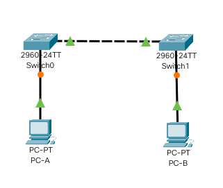
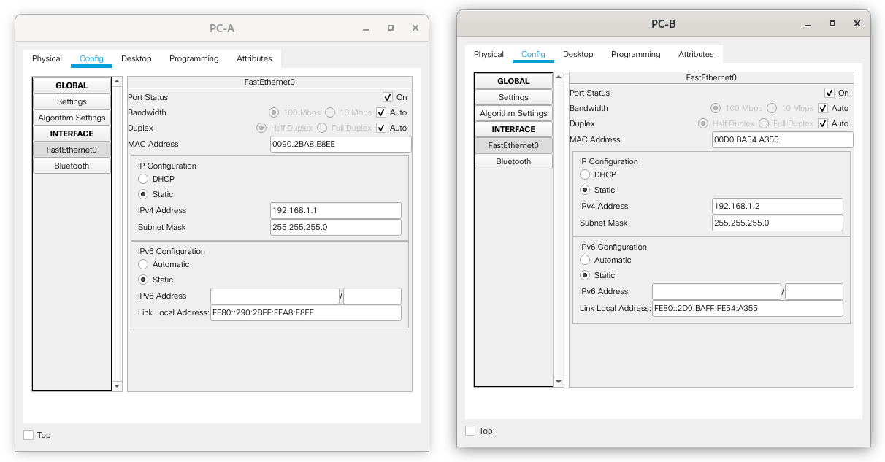

# Лабораторная работа №2. Просмотр таблицы MAC-адресов коммутатора.

###  Задание:

1. Создание и настройка сети.

 1.1. Подключение узлов сети в соответствии с топологией.

 1.2. Настройка узлов ПК.

 1.3. Выполнение базовых настроек каждого коммутатора:

- Настройка имен устройств в соответствии с топологией.
- Настройка IP-адресов устройств, как указано в таблице адресации.
- Назначение cisco в качестве паролей консоли и VTY.
- Назначение class в качестве пароля доступа к привилегированному режиму EXEC.

2. Изучение таблицы МАС-адресов коммутатора.

 2.1. Определение MAC-адресов узлов PC-A и PC-B. 

 2.2. Определение MAC-адресов интерфейсов Fast Ethernet 0/1 коммутаторов S1 и S2. 

 2.3. Изучение таблицы MAC-адресов на коммутаторе S2 до посылки эхо запросов. 

 2.4. Очистка таблицы MAC-адресов на коммутаторе S2 и повторный просмотр таблицы MAC-адресов.

 2.5. Посылка эхо запросов с узла PC-B на узел PC-A, а также коммутаторы S1 и S2.

 2.6. Изучение таблицы MAC-адресов на коммутаторе S2 после посылки эхо запросов. 

###  Решение:

####  1. Создание и настройка сети.

 1.1. Подключение узлов сети в соответствии с топологией.

В системе Cisco Packet Tracer была создана схема сети, представленная на следующем скриншоте




 1.2. Настройка узлов ПК.

Узлы PC-A и PC-B были настроены в соответсвии с заданием. Результаты настройки представлены на следующем скриншоте: 



 1.3. Выполнение базовых настроек каждого коммутатора:

- Настройка имен устройств в соответствии с топологией.

```
Switch> enable
Switch#configure terminal
Switch(config)#hostname S1
S1(config)#exit
```

```
Switch> enable
Switch#configure terminal
Switch(config)#hostname S2
S1(config)#exit
```

- Настройка IP-адресов устройств, как указано в таблице адресации.

```
S1#configure terminal
S1(config)#interface vlan1
S1(config-if)#ip address 192.168.1.11 255.255.255.0
S1(config-if)#no shutdown
S1(config-if)#exit
S1(config)#exit
S1#
```

```
S2#configure terminal
S2(config)#interface vlan1
S2(config-if)#ip address 192.168.1.12 255.255.255.0
S2(config-if)#no shutdown
S2(config-if)#exit
S2(config)#exit
S2#
```

- Назначение cisco в качестве паролей консоли и VTY.


```
S1#configure terminal
S1(config)#line console 0
S1(config-line)#password cisco
S1(config-line)#login
S1(config-line)#logging synchronous
S1(config-line)#exit
S1(config)#
S1(config)#line vty 0 15
S1(config-line)#password cisco
S1(config-line)#login
S1(config-line)#transport input telnet
S1(config-line)#exit
S1(config)#exit 
S1#
```


```
S2#configure terminal
S2(config)#line console 0
S2(config-line)#password cisco
S2(config-line)#login
S2(config-line)#logging synchronous
S2(config-line)#exit
S2(config)#
S2(config)#line vty 0 15
S2(config-line)#password cisco
S2(config-line)#login
S2(config-line)#transport input telnet
S2(config-line)#exit
S2(config)#exit 
S2#
```


- Назначение class в качестве пароля доступа к привилегированному режиму EXEC.

```
S1#
S1#configure terminal
S1(config)#enable secret class
S1(config)#exit 
S1#
```

```
S2#
S2#configure terminal
S2(config)#enable secret class
S2(config)#exit 
S2#
```

####  2. Изучение таблицы МАС-адресов коммутатора.

 2.1. Определение MAC-адресов узлов PC-A и PC-B. 

Ввод в командной строке узлов следующей команды:

```
ipconfig /all
```

Результат выполнения команды на узле PC-A:

```
FastEthernet0 Connection:(default port)

   Connection-specific DNS Suffix..: 
   Physical Address................: 0090.2BA8.E8EE
   Link-local IPv6 Address.........: FE80::290:2BFF:FEA8:E8EE
   IPv6 Address....................: ::
   IPv4 Address....................: 192.168.1.1
   Subnet Mask.....................: 255.255.255.0
   Default Gateway.................: ::
                                     0.0.0.0
   DHCP Servers....................: 0.0.0.0
   DHCPv6 IAID.....................: 
   DHCPv6 Client DUID..............: 00-01-00-01-8B-73-65-38-00-90-2B-A8-E8-EE
   DNS Servers.....................: ::
                                     0.0.0.0
```

Из вывода видно, что MAC адрес интерфейса узла **PC-A** : **00:90:2B:A8:E8:EE** 

Результат выполнения команды на узле PC-B: 

```
FastEthernet0 Connection:(default port)

   Connection-specific DNS Suffix..: 
   Physical Address................: 00D0.BA54.A355
   Link-local IPv6 Address.........: FE80::2D0:BAFF:FE54:A355
   IPv6 Address....................: ::
   IPv4 Address....................: 192.168.1.2
   Subnet Mask.....................: 255.255.255.0
   Default Gateway.................: ::
                                     0.0.0.0
   DHCP Servers....................: 0.0.0.0
   DHCPv6 IAID.....................: 
   DHCPv6 Client DUID..............: 00-01-00-01-CC-C2-20-59-00-D0-BA-54-A3-55
   DNS Servers.....................: ::
                                     0.0.0.0
```

Из вывода видно, что MAC адрес интерфейса узла **PC-B** : **00:D0:BA:54:A3:55** 

 2.2. Определение MAC-адресов интерфейсов Fast Ethernet 0/1 коммутаторов S1 и S2. 

Ввод в консоле на обоих коммутаторах селедующей команды:

```
S1> enable
S1#show interfaces F0/1
```

Результат выполнения команды на коммутаторе S1:

```
FastEthernet0/1 is up, line protocol is up (connected)
  Hardware is Lance, address is 00e0.b086.7d01 (bia 00e0.b086.7d01)
...
...
```
Из вывода видно, что MAC адрес интерфейса коммутатора **S1** : **00:E0:B0:86:7D:01** 

Результат выполнения команды на коммутаторе S2: 

```
FastEthernet0/1 is up, line protocol is up (connected)
  Hardware is Lance, address is 00e0.f962.db01 (bia 00e0.f962.db01)
```

Из вывода видно, что MAC адрес интерфейса коммутатора **S2** : **00:E0:F9:62:DB:01** 


 2.3. Изучение таблицы MAC-адресов на коммутаторе S2 до посылки эхо запросов. 

```
S2> enable
S2#show mac address-table
```

Результат выполнения команды на коммутаторе S2: 

```
          Mac Address Table
-------------------------------------------

Vlan    Mac Address       Type        Ports
----    -----------       --------    -----

   1    00e0.b086.7d01    DYNAMIC     Fa0/1
```

Из вывода видно, что в таблицу MAC-адресов внесена лишь одна запись о интерфейсе коммутатора S1 на порту Fa0/1.

 
 2.4. Очистка таблицы MAC-адресов на коммутаторе S2 и повторный просмотр таблицы MAC-адресов.

```
S2> enable
S2#clear mac address-table dynamic
S2#show mac address-table
```
Результат выполнения команды на коммутаторе S2: 

```
          Mac Address Table
-------------------------------------------

Vlan    Mac Address       Type        Ports
----    -----------       --------    -----

   1    00e0.b086.7d01    DYNAMIC     Fa0/1
```

Из вывода видно, что изменений в таблице MAC-адресов не произошло.

 2.5. Посылка эхо запросов с узла PC-B на узел PC-A, а также коммутаторы S1 и S2.

```
C:\>ping 192.168.1.1
C:\>ping 192.168.1.11
C:\>ping 192.168.1.12
```

Результат выполнения команды на узле PC-B: 

```
Pinging 192.168.1.1 with 32 bytes of data:

Reply from 192.168.1.1: bytes=32 time=1ms TTL=128
Reply from 192.168.1.1: bytes=32 time<1ms TTL=128
Reply from 192.168.1.1: bytes=32 time<1ms TTL=128
Reply from 192.168.1.1: bytes=32 time<1ms TTL=128

Pinging 192.168.1.11 with 32 bytes of data:

Request timed out.
Reply from 192.168.1.11: bytes=32 time<1ms TTL=255
Reply from 192.168.1.11: bytes=32 time<1ms TTL=255
Reply from 192.168.1.11: bytes=32 time<1ms TTL=255

Pinging 192.168.1.12 with 32 bytes of data:

Request timed out.
Reply from 192.168.1.12: bytes=32 time<1ms TTL=255
Reply from 192.168.1.12: bytes=32 time<1ms TTL=255
Reply from 192.168.1.12: bytes=32 time=1ms TTL=255
```

Вывод команды просмотра ARP-кэша компьютера PC-B:

```
C:\>arp -a
  Internet Address      Physical Address      Type
  192.168.1.1           0090.2ba8.e8ee        dynamic
  192.168.1.11          0060.2fc4.c103        dynamic
  192.168.1.12          00d0.d3ca.6a09        dynamic
```
Из вывода видно, что в ARP-кэше компьютера PC-B появились дополнительные записи для всех сетевых устройств, которым были отправлены эхо-запросы.


 2.6. Изучение таблицы MAC-адресов на коммутаторе S2 после посылки эхо запросов. 

```
S2> enable
S2#show mac address-table
```


Результат выполнения команды на коммутаторе S2: 

```
          Mac Address Table
-------------------------------------------

Vlan    Mac Address       Type        Ports
----    -----------       --------    -----

   1    0060.2fc4.c103    DYNAMIC     Fa0/1
   1    0090.2ba8.e8ee    DYNAMIC     Fa0/1
   1    00d0.ba54.a355    DYNAMIC     Fa0/18
   1    00e0.b086.7d01    DYNAMIC     Fa0/1

```

Из вывода видно, что сформировалась таблица MAC-адресов, со следующими значениями:

- MAC-адрес интерфейса узла **PC-A** (00:90:2B:A8:E8:EE) определен на интерфейсе Fa0/1 коммутатора S2
- MAC-адрес интерфейса узла **PC-B** (00:D0:BA:54:A3:55) определен на интерфейсе Fa0/18 коммутатора S2
- MAC-адрес интерфейса FE0/1 коммутатора **S1** (00:E0:B0:86:7D:01) определен на интерфейсе Fa0/1 коммутатора S2

Остается неизвестным MAC-адрес **0060.2fc4.c103** определенный на интерфейсе Fa0/1 коммутатора S2.
Исходя из топологии сети можно предположить, что это интерфейс FE0/6 коммутатора S1, которым этот коммутатор подключен к PC-A.
Проверим это:

```
S1> enable
S1#show interfaces F0/6
FastEthernet0/6 is up, line protocol is up (connected)
  Hardware is Lance, address is 00e0.b086.7d06 (bia 00e0.b086.7d06)
```
Нет, это не он.

Тогда посмотрим таблицу MAC-адресов коммутатора S1:

```
S1> enable
S1#show mac-address-table 
          Mac Address Table
-------------------------------------------

Vlan    Mac Address       Type        Ports
----    -----------       --------    -----

   1    0090.2ba8.e8ee    DYNAMIC     Fa0/6
   1    00d0.ba54.a355    DYNAMIC     Fa0/1
   1    00d0.d3ca.6a09    DYNAMIC     Fa0/1
   1    00e0.f962.db01    DYNAMIC     Fa0/1
```
У второго коммутатора S2 также есть такой неизвестный MAC-адрес **00d0.d3ca.6a09**

P.S. Как выяснилось, данные MAC-адреса - это адреса виртуальных сетевых интерфейсов VTY коммутаторов. 
