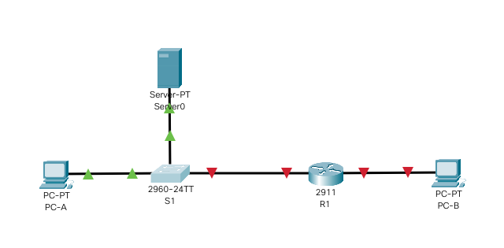

# Лабораторная работа №4. Настройка IPv6-адресов на сетевых устройствах.

###  Задание:

1. Настройка топологии и конфигурация основных параметров маршрутизатора и коммутатора.
2. Обновление образа IOS коммутатора до версии 15:
3. Ручная настройка IPv6-адресов.
4. Проверка сквозного соединения.

###  Решение:

#### 0. Подготовительные действия.

В задании указано, что шаблон по умолчанию менеджера базы данных 2960 Switch Database Manager (SDM) не поддерживает IPv6. 

Перед назначением IPv6-адреса SVI VLAN 1 может понадобиться выполнение команды **sdm prefer dual-ipv4-and-ipv6 default** для включения IPv6-адресации.

Создадим в программе cisco packet tracer сетевое устройство коммутатор Cisco 2960 Switch и выполним в нем команду **show sdm prefer** для определения поддержки IPv6:

```
S1> enable
S1# show sdm prefer
 The current template is "default" template.
 The selected template optimizes the resources in
 the switch to support this level of features for
 0 routed interfaces and 255 VLANs.

  number of unicast mac addresses:                  8K
  number of IPv4 IGMP groups:                       256
  number of IPv4/MAC qos aces:                      128
  number of IPv4/MAC security aces:                 384
```

Так как нет упоминания о IPv6, cудя по всему, в SDM данной версии IOS нет его поддержки. 

Также в задании сказано, что в лабораторной работе должен использоваться Cisco IOS версии 15.2(2) (образ lanbasek9). 

Проверим текущую версию IOS командой **show version** или **show run**  

```
S1# show version
Cisco IOS Software, C2960 Software (C2960-LANBASE-M), Version 12.2(25)FX, RELEASE SOFTWARE (fc1)
...
```

Версия IOS 12.2.

Видимо, необходимо обновить версию IOS для поддержки IPv6. Это будет сделано далее.


#### 1. Настройка топологии и конфигурация основных параметров маршрутизатора и коммутатора.


1.1 Создадим топологию данной сети в программе cisco packet tracer. Добавим в топологию данной сети TFTP сервер (server-pt), на котором содержатся образы IOS, настроим на нем IP адрес 192.168.1.2 и подключим его в порт FE0/1 коммутатора. 




1.2. Выполнение базовых настроек коммутатора:

- Настройка имени устройства в соответствии с топологией.

```
Switch> enable
Switch#configure terminal
Switch(config)#hostname S1
S1(config)#exit
```

- Назначение cisco в качестве паролей консоли, VTY и доступа к привилегированному режиму EXEC, а также отображение его в неявном виде в конфигурации и включение доступа по telnet.


```
S1#configure terminal
S1(config)#line console 0
S1(config-line)#password cisco
S1(config-line)#login
S1(config-line)#logging synchronous
S1(config-line)#exit
S1(config)#
S1(config)#line vty 0 15
S1(config-line)#password cisco
S1(config-line)#login
S1(config-line)#transport input telnet
S1(config-line)#exit
S1(config)#enable secret cisco
S1(config)#service password-encryption
S1(config)#exit 
S1#
```

- Настройка приветственного баннера:

```
S1#
S1#configure terminal
S1(config)#banner motd $ Authorized Access Only! $
S1(config)#exit 
S1#
```

- Настройка IPv4-адреса устройства для обновления IOS через TFTP.

```
S1#configure terminal
S1(config)#interface vlan1
S1(config-if)#ip address 192.168.1.1 255.255.255.0
S1(config-if)#no shutdown
S1(config-if)#exit
S1(config)#exit
S1#
```

- Сохранение настроенной конфигурации устройства.
```
S1#copy running-config startup-config
```

1.3. Выполнение базовых настроек маршрутизатора:


- Настройка имени устройства в соответствии с топологией.

```
Router> enable
Router#configure terminal
Router(config)#hostname R1
R1(config)#exit
```

- Назначение cisco в качестве паролей консоли, VTY и доступа к привилегированному режиму EXEC, а также отображение его в неявном виде в конфигурации и включение доступа по telnet.


```
R1#configure terminal
R1(config)#line console 0
R1(config-line)#password cisco
R1(config-line)#login
R1(config-line)#logging synchronous
R1(config-line)#exit
R1(config)#
R1(config)#line vty 0 15
R1(config-line)#password cisco
R1(config-line)#login
R1(config-line)#transport input telnet
R1(config-line)#exit
R1(config)#enable secret cisco
R1(config)#service password-encryption
R1(config)#exit 
R1#
```

- Настройка приветственного баннера:

```
R1#
R1#configure terminal
R1(config)#banner motd $ Authorized Access Only! $
R1(config)#exit 
R1#
```

- Сохранение настроенной конфигурации устройства.
```
R1#copy running-config startup-config
```

#### 2. Обновление образа IOS коммутатора до версии 15:

2.1. Проверим текущий образ и количество всей и свободной памяти на устройстве:

```
S1> enable
S1#show flash: 
Directory of flash:/

    1  -rw-     4414921          <no date>  c2960-lanbase-mz.122-25.FX.bin
    2  -rw-        1074          <no date>  config.text

64016384 bytes total (59600389 bytes free)
```
2.2. Скопируем образ c2960-lanbasek9-mz.150-2.SE4.bin:

```
S1#copy tftp flash
Address or name of remote host []? 192.168.1.2
Source filename []? c2960-lanbasek9-mz.150-2.SE4.bin
Destination filename [c2960-lanbasek9-mz.150-2.SE4.bin]? 

Accessing tftp://192.168.1.2/c2960-lanbasek9-mz.150-2.SE4.bin...
Loading c2960-lanbasek9-mz.150-2.SE4.bin from 192.168.1.2: !!!!!!!!!!!!!!!!!!!!!!!!!!!!!!!!!!!!!!!!!!!!!!!!!!!!!!!!!!!!!!!!!!!!!!!!!!!!!!!!!!!!!!!!!!!!
[OK - 4670455 bytes]

4670455 bytes copied in 0.103 secs (3645511 bytes/sec)
```
2.3. Еще раз выведем содержимое флэш-памяти устройства:

```
S1#show flash: 
Directory of flash:/

    1  -rw-     4414921          <no date>  c2960-lanbase-mz.122-25.FX.bin
    3  -rw-     4670455          <no date>  c2960-lanbasek9-mz.150-2.SE4.bin
    2  -rw-        1074          <no date>  config.text

64016384 bytes total (54929934 bytes free)
```

2.4. Последним шагом укажем устройству, к какому образу обращаться при загрузке операционной системы.

```
S1#configure terminal
S1(config)#boot system flash:c2960-lanbasek9-mz.150-2.SE4.bin
S1(config)#exit
```
2.5. Сохранение настроенной конфигурации устройства.

```
S1#copy running-config startup-config
```
2.6. Перезагрузим устройство.

```
S1#reload
```

2.7. Выполним команду **show sdm prefer**

```
S1#show sdm prefer
 The current template is "default" template.
 The selected template optimizes the resources in
 the switch to support this level of features for
 0 routed interfaces and 1024 VLANs.

  number of unicast mac addresses:                  8K
  number of IPv4 IGMP groups + multicast routes:    0.25K
  number of IPv4 unicast routes:                    0
  number of IPv6 multicast groups:                  0
  number of directly-connected IPv6 addresses:      0
  number of indirect IPv6 unicast routes:           0
  number of IPv4 policy based routing aces:         0
  number of IPv4/MAC qos aces:                      0.125k
  number of IPv4/MAC security aces:                 0.375k
  number of IPv6 policy based routing aces:         0
  number of IPv6 qos aces:                          20
  number of IPv6 security aces:                     25
```

Упоминание о IPv6 есть, но на всякий случай выполним команду **sdm prefer dual-ipv4-and-ipv6 default**, указанную в задании, для однозначного включения поддержки IPv6.

2.8. Выполним команду **sdm prefer dual-ipv4-and-ipv6 default**

```
S1#configure terminal
S1(config)#sdm prefer dual-ipv4-and-ipv6 default
Changes to the running SDM preferences have been stored, but cannot take effect until the next reload.
Use 'show sdm prefer' to see what SDM preference is currently active.
```

Команда применилась, но эффект от выполнения команды наступит после перезагрузки коммутатора, поэтому сохраним конфигурацию и перезагрузим устройство.

2.9. Сохраненим настроенную конфигурацию устройства.

```
R1#copy running-config startup-config
```


2.10. Перезагрузим устройство.

```
S1#reload
```

2.11. Выполним команду **show sdm prefer**

```
S1#show sdm prefer
 The current template is "dual-ipv4-and-ipv6 default" template.
 The selected template optimizes the resources in
 the switch to support this level of features for
 0 routed interfaces and 1024 VLANs.

  number of unicast mac addresses:                  4K
  number of IPv4 IGMP groups + multicast routes:    0.25K
  number of IPv4 unicast routes:                    0
  number of IPv6 multicast groups:                  0.375k
  number of directly-connected IPv6 addresses:      0
  number of indirect IPv6 unicast routes:           0
  number of IPv4 policy based routing aces:         0
  number of IPv4/MAC qos aces:                      0.125K
  number of IPv4/MAC security aces:                 0.375K
  number of IPv6 policy based routing aces:         0
  number of IPv6 qos aces:                          0.625k
  number of IPv6 security aces:                     0.125K
```

Итак теперь шаблон менеджера баз данных коммутатора установлен в "dual-ipv4-and-ipv6 default" и точно поддерживает IPv6.

3. Ручная настройка IPv6-адресов.

3.1. Настройка IPv6-адресов маршрутизатора R1 в соответствии с заданием.

```
R1#configure terminal
R1(config)#interface ge0/0
R1(config-if)#ipv6 enable
R1(config-if)#ipv6 address 2001:db8:acad:a::1/64
R1(config-if)#ipv6 address fe80::1 link-local
R1(config-if)#no shutdown
R1(config-if)#exit
R1(config)#interface ge0/1
R1(config-if)#ipv6 enable
R1(config-if)#ipv6 address 2001:db8:acad:1::1/64
R1(config-if)#ipv6 address fe80::1 link-local
R1(config-if)#no shutdown
R1(config-if)#exit
R1(config)#exit
R1#
```

Вывод команды **show ipv6 interface brief**

```
R1#show ipv6 interface brief
GigabitEthernet0/0         [up/up]
    FE80::1
    2001:DB8:ACAD:A::1
GigabitEthernet0/1         [up/up]
    FE80::1
    2001:DB8:ACAD:1::1
GigabitEthernet0/2         [administratively down/down]
    unassigned
Vlan1                      [administratively down/down]
    unassigned
```

Вывод команды **show ipv6 interface gigabitEthernet0/0**

```
R1#show ipv6 interface gigabitEthernet0/0
GigabitEthernet0/0 is up, line protocol is up
  IPv6 is enabled, link-local address is FE80::1
  No Virtual link-local address(es):
  Global unicast address(es):
    2001:DB8:ACAD:A::1, subnet is 2001:DB8:ACAD:A::/64
  Joined group address(es):
    FF02::1
    FF02::1:FF00:1
  MTU is 1500 bytes
  ICMP error messages limited to one every 100 milliseconds
  ICMP redirects are enabled
  ICMP unreachables are sent
  ND DAD is enabled, number of DAD attempts: 1
  ND reachable time is 30000 milliseconds
```

Как мы видим из вывода команды, интерфейсу gigabitEthernet0/0 назначены следующие группы многоадресной рассылки: **FF02::1** и **FF02::1:FF00:1**

3.2. Активизация IPv6-маршрутизации на роутере R1

- Перед активизацией выполним команду **ipconfig** на PC-B, который подключен к R1

```
C:\>ipconfig

FastEthernet0 Connection:(default port)

   Connection-specific DNS Suffix..: 
   Link-local IPv6 Address.........: FE80::230:A3FF:FEEC:BCB4
   IPv6 Address....................: ::
   IPv4 Address....................: 0.0.0.0
   Subnet Mask.....................: 0.0.0.0
   Default Gateway.................: ::
                                     0.0.0.0
```

- Активизируем IPv6-маршрутизацию на роутере R1

```
R1#configure terminal
R1(config)#ipv6 unicast-routing
R1(config)#exit
```

Примечание. Это позволит компьютерам получать IP-адреса и данные шлюза по умолчанию с помощью функции SLAAC (Stateless Address Autoconfiguration (Автоконфигурация без сохранения состояния адреса)).

- Сохраненим настроенную конфигурацию устройства.

```
R1#copy running-config startup-config
```

- Снова выполним команду на PC-B, который подключен к R1

```
C:\>ipconfig

FastEthernet0 Connection:(default port)

   Connection-specific DNS Suffix..: 
   Link-local IPv6 Address.........: FE80::230:A3FF:FEEC:BCB4
   IPv6 Address....................: 2001:DB8:ACAD:A:230:A3FF:FEEC:BCB4
   IPv4 Address....................: 0.0.0.0
   Subnet Mask.....................: 0.0.0.0
   Default Gateway.................: FE80::1
                                     0.0.0.0
```

Как мы видим, интерфейсу автоматически присвоен IP-адрес и назначен шлюз по умолчанию с помощью функции SLAAC.


3.3. Настройка IPv6 адреса виртуальному интерфейсу VTY коммутатора в соответствии с заданием.


- Назначим IPv6 адрес виртуальному интерфейсу VTY коммутатора S1

```
S1#configure terminal
S1(config)#interface vlan1
S1(config-if)#ipv6 address 2001:db8:acad:1::b/64
S1(config-if)#no shutdown
S1(config-if)#exit
S1(config)#exit
S1#
```

- Выполним команду **show ipv6 interface vlan 1**


```
S1#show ipv6 interface vlan 1
Vlan1 is up, line protocol is up
  IPv6 is enabled, link-local address is FE80::209:7CFF:FE23:6D67
  No Virtual link-local address(es):
  Global unicast address(es):
    2001:DB8:ACAD:1::B, subnet is 2001:DB8:ACAD:1::/64
  Joined group address(es):
    FF02::1
    FF02::1:FF00:B
    FF02::1:FF23:6D67
  MTU is 1500 bytes
  ICMP error messages limited to one every 100 milliseconds
  ICMP redirects are enabled
  ICMP unreachables are sent
  Output features: Check hwidb
  ND DAD is enabled, number of DAD attempts: 1
  ND reachable time is 30000 milliseconds
  ND NS retransmit interval is 1000 milliseconds

```


3.3. Настройка IPv6-адресов узлов PC-A и PC-B.

Назначим интерфейсам узлов PC-A и PC-B статические IPv6 адреса в соответствии с заданием. 

Вывод команды **ipconfig** хоста PC-A 

```
C:\>ipconfig

FastEthernet0 Connection:(default port)

   Connection-specific DNS Suffix..: 
   Link-local IPv6 Address.........: FE80::290:CFF:FE11:6B29
   IPv6 Address....................: 2001:DB8:ACAD:1::3
   IPv4 Address....................: 0.0.0.0
   Subnet Mask.....................: 0.0.0.0
   Default Gateway.................: FE80::1
                                     0.0.0.0
```
Вывод команды **ipconfig** хоста PC-B 

```
C:\>ipconfig

FastEthernet0 Connection:(default port)

   Connection-specific DNS Suffix..: 
   Link-local IPv6 Address.........: FE80::230:A3FF:FEEC:BCB4
   IPv6 Address....................: 2001:DB8:ACAD:A::3
   IPv4 Address....................: 0.0.0.0
   Subnet Mask.....................: 0.0.0.0
   Default Gateway.................: FE80::1
                                     0.0.0.0
```

4. Проверка сквозного соединения.

4.1. С PC-A отправим эхо-запрос на FE80::1. Это локальный адрес канала, назначенный G0/1 на R1.

```
C:\> ping FE80::1

Pinging FE80::1 with 32 bytes of data:

Reply from FE80::1: bytes=32 time=1ms TTL=255
Reply from FE80::1: bytes=32 time<1ms TTL=255
Reply from FE80::1: bytes=32 time<1ms TTL=255
Reply from FE80::1: bytes=32 time<1ms TTL=255

Ping statistics for FE80::1:
    Packets: Sent = 4, Received = 4, Lost = 0 (0% loss),
Approximate round trip times in milli-seconds:
    Minimum = 0ms, Maximum = 1ms, Average = 0ms
```

4.2. Отправим эхо-запрос на интерфейс управления S1 с PC-A.

```
C:\>ping 2001:db8:acad:1::b

Pinging 2001:db8:acad:1::b with 32 bytes of data:

Reply from 2001:DB8:ACAD:1::B: bytes=32 time=1ms TTL=255
Reply from 2001:DB8:ACAD:1::B: bytes=32 time<1ms TTL=255
Reply from 2001:DB8:ACAD:1::B: bytes=32 time<1ms TTL=255
Reply from 2001:DB8:ACAD:1::B: bytes=32 time<1ms TTL=255

Ping statistics for 2001:DB8:ACAD:1::B:
    Packets: Sent = 4, Received = 4, Lost = 0 (0% loss),
Approximate round trip times in milli-seconds:
    Minimum = 0ms, Maximum = 1ms, Average = 0ms
```

4.3. Введем команду tracert на PC-A, чтобы проверить наличие сквозного подключения к PC-B.

```
C:\>tracert 2001:db8:acad:a::3

Tracing route to 2001:db8:acad:a::3 over a maximum of 30 hops: 

  1   1 ms      0 ms      0 ms      2001:DB8:ACAD:1::1
  2   0 ms      0 ms      0 ms      2001:DB8:ACAD:A::3

Trace complete.
```
4.4. С PC-B отправим эхо-запрос на PC-A.

```
C:\>ping 2001:db8:acad:1::3

Pinging 2001:db8:acad:1::3 with 32 bytes of data:

Reply from 2001:DB8:ACAD:1::3: bytes=32 time=1ms TTL=127
Reply from 2001:DB8:ACAD:1::3: bytes=32 time=1ms TTL=127
Reply from 2001:DB8:ACAD:1::3: bytes=32 time<1ms TTL=127
Reply from 2001:DB8:ACAD:1::3: bytes=32 time<1ms TTL=127

Ping statistics for 2001:DB8:ACAD:1::3:
    Packets: Sent = 4, Received = 4, Lost = 0 (0% loss),
Approximate round trip times in milli-seconds:
    Minimum = 0ms, Maximum = 1ms, Average = 0ms
```

4.5. С PC-B отправим эхо-запрос на локальный адрес канала G0/0 на R1.

```
C:\>ping fe80::1

Pinging fe80::1 with 32 bytes of data:

Reply from FE80::1: bytes=32 time=1ms TTL=255
Reply from FE80::1: bytes=32 time<1ms TTL=255
Reply from FE80::1: bytes=32 time<1ms TTL=255
Reply from FE80::1: bytes=32 time<1ms TTL=255

Ping statistics for FE80::1:
    Packets: Sent = 4, Received = 4, Lost = 0 (0% loss),
Approximate round trip times in milli-seconds:
    Minimum = 0ms, Maximum = 1ms, Average = 0ms
```

4.6. Выведем arp-таблицы на PC-A и PC-B (дополнительный тест, которого нет в задании).

```
C:\>arp -a
No ARP Entries Found
```
Странно, по идее в arp кэш должны были внестись записи о IPv6 адресах PC-A и PC-B. Задам вопрос преподавателям.

