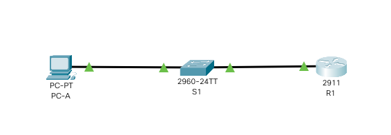

# Лабораторная работа №5. Доступ к сетевым устройствам по протоколу SSH.

###  Задание:

1. Настройка основных параметров устройств.
2. Настройка маршрутизатора для доступа по протоколу SSH.
3. Настройка коммутатора для доступа по протоколу SSH.
4. Работа по SSH через интерфейс командной строки (CLI) коммутатора

###  Решение:

#### 1. Настройка основных параметров устройств.


1.1 Создадим топологию данной сети в программе cisco packet tracer. 




1.2. Выполнение базовых настроек маршрутизатора:


- Настройка имени устройства в соответствии с топологией.

```
Router> enable
Router#configure terminal
Router(config)#hostname R1
R1(config)#
```

- Отключение поиска DNS, чтобы предотвратить попытки маршрутизатора неверно преобразовывать введенные команды таким образом, как будто они являются именами узлов.

```
R1(config)#no ip domain-lookup
```

- Назначение пароля **cisco** в качестве пароля консоли:


```
R1(config)#line console 0
R1(config-line)#password cisco
R1(config-line)#login
R1(config-line)#logging synchronous
R1(config-line)#exit
R1(config)#
```

- Назначение пароля **cisco** в качестве пароля VTY:

```
R1(config)#line vty 0 15
R1(config-line)#password cisco
R1(config-line)#login
R1(config-line)#exit
R1(config)#
```

- Настройка пароля для входа в привилегированный режим и настройка отображения этого пароля в неявном виде при выводе команды **show running-config**

```
R1(config)#enable secret class
R1(config)#service password-encryption
R1(config)#
```

- Настройка приветственного баннера:

```
R1(config)#banner motd $ Authorized Access Only! $
```

- Настройка и активация на маршрутизаторе R1 интерфейса G0/1 в соответствии с заданием

```
R1(config)#interface ge0/1
R1(config-if)#ip address 192.168.1.1 255.255.255.0
R1(config-if)#no shutdown
R1(config-if)#exit
R1(config)#exit
R1#
```

- Сохранение настроенной конфигурации устройства.

```
R1#copy running-config startup-config
```

1.3. Настройка IP-адреса и маски подсети для PC-A в соответствии с заданием.

Настроим через вкладку **Config** окна узла PC-A его IPv4 адрес **192.168.1.3** и шлюз по умолчанию **192.168.1.1**

1.4. Проверка доступности маршрутизатора R1 с узла PC-A

```
C:\>ping 192.168.1.1
Pinging 192.168.1.1 with 32 bytes of data:
Reply from 192.168.1.1: bytes=32 time=1ms TTL=255
Reply from 192.168.1.1: bytes=32 time<1ms TTL=255
Reply from 192.168.1.1: bytes=32 time<1ms TTL=255
Reply from 192.168.1.1: bytes=32 time<1ms TTL=255
```

#### 2. Настройка маршрутизатора для доступа по протоколу SSH.


