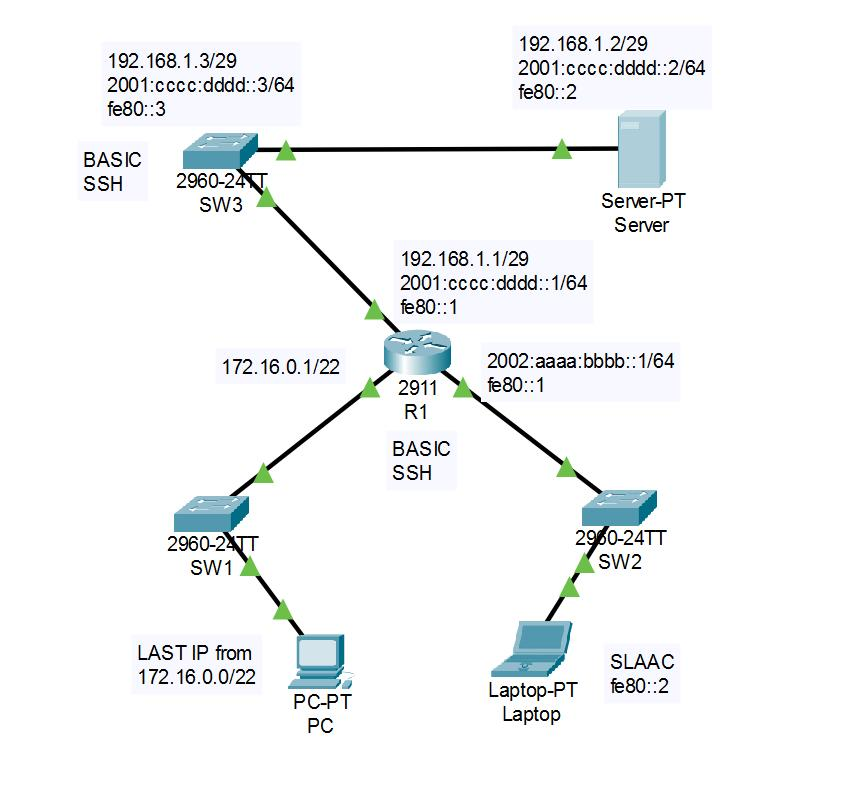

# Лабораторная работа №6. Организация простой сети (практическое занятие).

#### 1. Создание топологии

Создадим топологию данной сети в программе cisco packet tracer. 




#### 1. Настройка основных параметров устройств.


##### 1.1. Выполнение базовых настроек маршрутизатора:


- Настройка имени устройства в соответствии с топологией.

```
Router> enable
Router#configure terminal
Router(config)#hostname R1
R1(config)#
```

- Отключение поиска DNS, чтобы предотвратить попытки маршрутизатора неверно преобразовывать введенные команды таким образом, как будто они являются именами узлов.

```
R1(config)#no ip domain-lookup
```

- Установка параметра минимальной длины пароля в 5 символов.

```
R1(config)#security passwords min-length 5
```

- Предотвращение перебора пароля методом грубой силы

```
R1(config)#login block-for 120 attempts 3 within 60
```

- Назначение пароля **cisco** в качестве пароля консоли:


```
R1(config)#line console 0
R1(config-line)#password cisco
R1(config-line)#login
R1(config-line)#logging synchronous
R1(config-line)#exit
R1(config)#
```

- Назначение пароля **cisco** в качестве пароля VTY и отключение доступа к неактивному привилегированному режиму через заданное время:

```
R1(config)#line vty 0 15
R1(config)#exec-timeout 5 30
R1(config-line)#password cisco
R1(config-line)#login
R1(config-line)#exit
R1(config)#
```

- Настройка пароля для входа в привилегированный режим и настройка отображения этого пароля в неявном виде при выводе команды **show running-config**

```
R1(config)#enable secret class
R1(config)#service password-encryption
R1(config)#
```

- Настройка приветственного баннера:

```
R1(config)#banner motd $ Authorized Access Only! $
```

- Настройка и активация на маршрутизаторе R1 интерфейсов G0/0 (левая ветвь сети), G0/1 (правая ветвь), G0/2 (верхняя ветвь) в соответствии с топологией

```
R1(config)#interface ge0/0
R1(config-if)#ip address 172.16.0.1 255.255.252.0
R1(config-if)#no shutdown
R1(config-if)#exit
R1(config)#interface ge0/1
R1(config-if)#ipv6 address 2002:aaaa:bbbb::1/64 
R1(config-if)#ipv6 address fe80::1 link-local
R1(config-if)#no shutdown
R1(config-if)#exit
R1(config)#interface ge0/2
R1(config-if)#ip address 192.168.1.1 255.255.255.248
R1(config-if)#ipv6 address 2001:cccc:dddd::1/64 
R1(config-if)#ipv6 address fe80::1 link-local
R1(config-if)#no shutdown
R1(config-if)#exit
R1(config)#exit
R1#
```

- Настройка доступа по SSH. Зададим доменное имя устройства

```
R1#configure terminal
R1(config)#ip domain-name R1
```

- Настройка доступа по SSH. Сгенерируем ключ шифрования с указанием его длины.

```
R1(config)#crypto key generate rsa general-keys modulus 1024
The name for the keys will be: R1.R1
% The key modulus size is 1024 bits
% Generating 1024 bit RSA keys, keys will be non-exportable...[OK]
*Mar 1 0:38:43.894: %SSH-5-ENABLED: SSH 1.99 has been enabled
```
- Настройка доступа по SSH. Создадим пользоваеля admin с паролем Adm1n в качестве пароля.

```
R1(config)#username admin privilege 15 secret Adm1n
```

- Настройка доступа по SSH. Включаем SSH сервер v2

```
R1(config)#ip ssh version 2
```
- Настройка доступа по SSH. Активируем протокол SSH и telnet на линиях VTY:

```
R1(config)#line vty 0 15 
R1(config-line)#transport input all
R1(config-line)#login local
R1(config)#exit
R1#
```

- Настройка доступа по SSH. Указываем маршрутизатору использовать локальную базу учетных записей для аутентификации.

```
R1(config-line)#login local
R1(config)#exit
R1#
```
- Сохранение настроенной конфигурации устройства.

```
R1#copy running-config startup-config
```

##### 1.2. Выполнение базовых настроек коммутатора.

- Настройка имени устройства в соответствии с топологией.

```
Switch> enable
Switch#configure terminal
Switch(config)#hostname SW3
SW3(config)#
```

- Отключение поиска DNS, чтобы предотвратить попытки маршрутизатора неверно преобразовывать введенные команды таким образом, как будто они являются именами узлов.

```
SW3(config)#no ip domain-lookup
```

- Назначение пароля **cisco** в качестве пароля консоли:

```
SW3(config)#line console 0
SW3(config-line)#password cisco
SW3(config-line)#login
SW3(config-line)#logging synchronous
SW3(config-line)#exit
SW3(config)#
```

- Назначение пароля **cisco** в качестве пароля VTY и отключение доступа к неактивному привилегированному режиму через заданное время:

```
SW3(config)#line vty 0 15
SW3(config)#exec-timeout 5 30
SW3(config-line)#password cisco
SW3(config-line)#login
SW3(config-line)#exit
SW3(config)#
```

- Настройка пароля для входа в привилегированный режим и настройка отображения этого пароля в неявном виде при выводе команды **show running-config**

```
SW3(config)#enable secret class
SW3(config)#service password-encryption
SW3(config)#
```

- Настройка приветственного баннера:

```
SW3(config)#banner motd $ Authorized Access Only! $
```

- Настройка и активация на коммутаторе SW3 интерфейса VTY:

```
SW3(config)#interface vlan 1
SW3(config-if)#ip address 192.168.1.3 255.255.255.248
SW3(config-if)#ipv6 address 2001:cccc:dddd::3/64
SW3(config-if)#ipv6 address fe80::3 link-local
SW3(config-if)#no shutdown
SW3(config-if)#exit
```
- Настройка шлюза по умолчанию

```
SW3(config)#ip default-gateway 192.168.1.1
```

- Настройка доступа по SSH. Зададим доменное имя устройства

```
SW3#configure terminal
SW3(config)#ip domain-name SW3
```

- Настройка доступа по SSH. Сгенерируем ключ шифрования с указанием его длины.

```
SW3(config)#crypto key generate rsa general-keys modulus 1024
The name for the keys will be: SW3.SW3
% The key modulus size is 1024 bits
% Generating 1024 bit RSA keys, keys will be non-exportable...[OK]
*Mar 1 0:20:41.373: %SSH-5-ENABLED: SSH 1.99 has been enabled
```
- Настройка доступа по SSH. Создадим пользоваеля admin с паролем Adm1n в качестве пароля.

```
SW3(config)#username admin privilege 15 secret Adm1n
```

- Настройка доступа по SSH. Включаем SSH сервер v2

```
SW3(config)#ip ssh version 2
```
- Настройка доступа по SSH. Активируем протокол SSH и telnet на линиях VTY:

```
SW3(config)#line vty 0 15 
SW3(config-line)#transport input all
SW3(config-line)#login local
SW3(config)#exit
SW3#
```

- Настройка доступа по SSH. Указываем коммутатору использовать локальную базу учетных записей для аутентификации.

```
SW3(config-line)#login local
SW3(config)#exit
SW3#
```

- Сохранение настроенной конфигурации устройства.

```
SW3#copy running-config startup-config
```


##### 1.3. Настройка терминальных узлов сети в соответствии с топологией.

Настроим через вкладку **Desktop - IP configuration** окна узла PC его IPv4 адрес **172.16.3.254 netmask 255.255.252.0** (по условиям задания - последний адрес узла в этой подсети) и шлюз по умолчанию **172.16.0.1**

Настроим через вкладку **Desktop - IP configuration** окна узла Laptop его IPv6 link-local адрес **fe80::2** и выберем **Automatic IPv6 Configuration**. Тогда узел сам настроит свой глобальный IPV6 адрес и адрес шлюза по технологии SLAAC.

Настроим через вкладку **Desktop - IP configuration** окна узла Server0 его IPv4 адрес **192.168.1.2 netmask 255.255.255.248**, IPv4 шлюз по умолчанию **192.168.1.1**, IPv6 link-local адрес **fe80::2**, глобальный IPV6 адрес **2001:cccc:dddd::2**, IPv6 шлюз по умолчанию **FE80::1**

#### 2. Проверка доступа по SSH с терминальных устройств.

Проверяем доступ на маршрутизатор по ssh по адресам **172.16.0.1**, **2001:cccc:dddd::1**, **192.168.1.1**, **FE80::1**

По всем адресам доступ на маршрутизатор есть, кроме **FE80::1** (что так и должно быть, хотя не понятно почему).


#### 3. Настройка DNS-сервера на Server0.

Включаем сервис DNS на Server0. Вносим в него две записи о соответсвия IP адреса и названии сервера Server0:

```test.site 192.168.1.2
```

```test.site 2001:CCCC:DDDD::2
```

На терминальных узлах прописываем соответсвенно IPv4 и IPv6 адреса DNS-сервера.
На устройстве Laptop необходимо выключить SLAAC, так как в этом режиме, по видимому, адрес DNS выдается маршрутизатором, но мы на нем его не настраивали, поэтому в режиме SLAAC он автоматически узлу не выдался.

Заходим с устройств в web-браузере на Server0 по адресу test.site - успешно. 

Все настроено.


