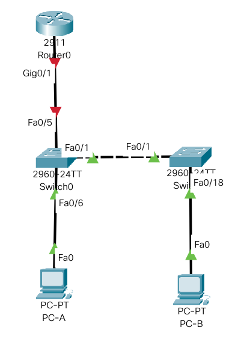

# Лабораторная работа №7. Внедрение маршрутизации между виртуальными локальными сетями.

###  Задание:

1. Создание сети и настройка основных параметров устройств.
2. Создание сетей VLAN и назначение портов коммутаторов.
3. Настройка транка 802.1Q между коммутаторами и маршрутизатором.
4. Настройка маршрутизации между сетями VLAN.
5. Проверка маршрутизация между VLAN.

###  Решение:

#### 1. Создание сети и настройка основных параметров устройств.


##### 1.1 Создадим топологию данной сети в программе cisco packet tracer. 




##### 1.2. Выполнение базовых настроек маршрутизатора:


- Настройка имени устройства в соответствии с топологией.

```
Router> enable
Router#configure terminal
Router(config)#hostname R1
R1(config)#
```

- Отключение поиска DNS, чтобы предотвратить попытки маршрутизатора неверно преобразовывать введенные команды таким образом, как будто они являются именами узлов.

```
R1(config)#no ip domain-lookup
```

- Создадим пользоваеля admin с паролем cisco в качестве пароля.

```
R1(config)#username admin privilege 0 secret cisco
```

- Предотвращение перебора пароля методом грубой силы

```
R1(config)#login block-for 120 attempts 3 within 60
```

- Настройка использования локальной БД (с ранее заведенными пользвателем admin) для аутентификации доступа в консоль:


```
R1(config)#line console 0
R1(config-line)#login local
R1(config-line)#logging synchronous
R1(config-line)#exit
R1(config)#
```

- Настройка использования локальной БД (с ранее заведенными пользвателем admin) для аутентификации доступа к линиям VTY и отключение доступа к неактивному привилегированному режиму через заданное время:

```
R1(config)#line vty 0 15
R1(config-line)#exec-timeout 5 30
R1(config-line)#login local
R1(config-line)#exit
R1(config)#
```

- Настройка пароля для входа в привилегированный режим и настройка отображения этого пароля в неявном виде при выводе команды **show running-config**

```
R1(config)#enable secret cisco
R1(config)#service password-encryption
R1(config)#
```

- Настройка приветственного баннера:

```
R1(config)#banner motd $ Authorized Access Only! $
```

- Сохранение настроенной конфигурации устройства

```
R1#copy running-config startup-config
```


- Настройка времени на маршрутизаторе

```
R1#clock set 11:33:25 MAY 6 2021
R1#show clock set
```


##### 1.3. Выполнение базовых настроек на каждом коммутаторе (описание только для первого):


```
Switch> enable
Switch#configure terminal
Switch(config)#hostname S1
S1(config)#
```

- Отключение поиска DNS, чтобы предотвратить попытки маршрутизатора неверно преобразовывать введенные команды таким образом, как будто они являются именами узлов.

```
S1(config)#no ip domain-lookup
```

- Создадим пользоваеля admin с паролем cisco в качестве пароля.

```
S1(config)#username admin privilege 0 secret cisco
```


- Настройка использования локальной БД (с ранее заведенными пользвателем admin) для аутентификации доступа в консоль:


```
S1(config)#line console 0
S1(config-line)#login local
S1(config-line)#logging synchronous
S1(config-line)#exit
S1(config)#
```

- Настройка использования локальной БД (с ранее заведенными пользвателем admin) для аутентификации доступа к линиям VTY и отключение доступа к неактивному привилегированному режиму через заданное время:

```
S1(config)#line vty 0 15
S1(config-line)#exec-timeout 5 30
S1(config-line)#login local
S1(config-line)#exit
S1(config)#
```

- Настройка пароля для входа в привилегированный режим и настройка отображения этого пароля в неявном виде при выводе команды **show running-config**

```
S1(config)#enable secret cisco
S1(config)#service password-encryption
S1(config)#
```

- Настройка приветственного баннера:

```
S1(config)#banner motd $ Authorized Access Only! $
```

- Сохранение настроенной конфигурации устройства

```
S1#copy running-config startup-config
```

##### 1.4. Выполнение базовых настроек узлов ПК.

Настроим сетевые параметры узлов ПК (IP адреса, маски и шлюзы) в соответствии с заданием.


#### 2. Создание сетей VLAN и назначение портов коммутаторов.


В соответсвии с заданием на каждом коммутаторе необходимо создать 5 VLAN: 10, 20, 30, 999 и 1000.

- Создание необходимых VLAN (выполняется  одинаково на обоих коммутаторах)


```
S1(config)#vlan 10
S1(config-vlan)#name network_management
S1(config-vlan)#exit
S1(config)#vlan 20
S1(config-vlan)#name sales
S1(config-vlan)#exit
S1(config)#vlan 30
S1(config-vlan)#name operations
S1(config-vlan)#exit
S1(config)#vlan 999
S1(config-vlan)#name parking_lot
S1(config-vlan)#exit
S1(config)#vlan 1000
S1(config-vlan)#name native_vlan
S1(config-vlan)#exit
```

- Настройка интерфейса VTY в административном VLAN 10 на коммутаторе S1

```
S1(config)#interface vlan 10
S1(config-if)#ip address 192.168.10.11 255.255.255.0
S1(config-if)#no shutdown
S1(config-if)#exit
S1(config)#ip default-gateway 192.168.10.1 
```

- Настройка интерфейса VTY в административном VLAN 10 на коммутаторе S2

```
S2(config)#interface vlan 10
S2(config-if)#ip address 192.168.10.12 255.255.255.0
S2(config-if)#default-gateway 192.168.10.1
S2(config-if)#no shutdown
S2(config-if)#exit
S2(config)#ip default-gateway 192.168.10.1 
```

- Включение портов в соответсвующие VLAN на коммутаторе S1


```
S1(config)#interface range fastEthernet 0/2 - 4 , fastEthernet 0/7 -24 , GigabitEthernet 0/1 - 2
S1(config-if-range)#switchport mode access
S1(config-if-range)#switchport access vlan 999
S1(config-if-range)#shutdown
S1(config-if-range)#exit
S1(config)#interface fastEthernet 0/6
S1(config-if)#switchport mode access
S1(config-if)#switchport access vlan 20
S1(config-if)#exit
```


- Включение портов в соответсвующие VLAN на коммутаторе S2


```
S2(config)#interface range fastEthernet 0/2 - 17 , fastEthernet 0/19 - 24 , GigabitEthernet 0/1 - 2
S2(config-if-range)#switchport mode access
S2(config-if-range)#switchport access vlan 999
S2(config-if-range)#shutdown
S2(config-if-range)#exit
S2(config)#interface fastEthernet 0/18
S2(config-if)#switchport mode access
S2(config-if)#switchport access vlan 30
S2(config-if)#exit
```

- Сохранение настроенной конфигурации устройств

```
S1#copy running-config startup-config
S2#copy running-config startup-config
```

#### 3. Настройка транка 802.1Q между коммутаторами и маршрутизатором.


- Настройка на коммутаторе S1 магистрального канала между S1 и S2 и между S1 и маршрутизатором R1

```
S1(config)#interface fastEthernet 0/1
S1(config-if)#switchport mode trunk
S1(config-if)#switchport trunk allowed vlan 10,20,30,1000
S1(config-if)#switchport trunk native vlan 1000
S1(config-if)#no shutdown
S1(config-if)#exit
S1(config)#interface fastEthernet 0/5
S1(config-if)#switchport mode trunk
S1(config-if)#switchport trunk allowed vlan 10,20,30,1000
S1(config-if)#switchport trunk native vlan 1000
S1(config-if)#no shutdown
S1(config-if)#exit
```

- Настройка на коммутаторе S2 магистрального канала между S1 и S2 

```
S2(config)#interface fastEthernet 0/1
S2(config-if)#switchport mode trunk
S1(config-if)#switchport trunk allowed vlan 10,20,30,1000
S2(config-if)#switchport trunk native vlan 1000
S2(config-if)#no shutdown
S2(config-if)#exit
```

- Сохранение настроенной конфигурации устройств

```
S1#copy running-config startup-config
S2#copy running-config startup-config
```


#### 4. Настройка маршрутизации между сетями VLAN на маршрутизаторе (роутер-на-палке).

- Настройка сабинтерфейсов

```
R1(config)#interface GigabitEthernet0/1.10
R1(config-subif)#description network_management_vlan
R1(config-subif)#encapsulation dot1Q 10
R1(config-subif)#ip address 192.168.10.1 255.255.255.0
R1(config-subif)#end
R1(config)#interface GigabitEthernet0/1.20
R1(config-subif)#description sales_vlan
R1(config-subif)#encapsulation dot1Q 20
R1(config-subif)#ip address 192.168.20.1 255.255.255.0
R1(config-subif)#end
R1(config)#interface GigabitEthernet0/1.30
R1(config-subif)#description operations_vlan
R1(config-subif)#encapsulation dot1Q 30
R1(config-subif)#ip address 192.168.30.1 255.255.255.0
R1(config-subif)#end
R1(config)#interface GigabitEthernet0/1.1000
R1(config-subif)#description native_vlan
R1(config-subif)#encapsulation dot1Q 1000 native
R1(config-subif)#end
```

*Примечание: при настройке сабинтерфейсов родительский интерфейс настраивать нельзя

- Включение родительского интерфейса без настройки 

```
R1(config)#interface GigabitEthernet0/1
R1(config-if)#no shutdown
R1(config-if)#end
```

- Сохранение настроенной конфигурации

```
R1#copy running-config startup-config
```

В отличие от коммутатора на машрутизаторе уже включена функция маршрутизации (неожиданно :-))), поэтому больше ничего настраивать не надо. 

Маршрутизатор сам определит сети прямого подключения и маршруты к ним, поэтому маршрутизация между VLAN будет работать автоматически. 


#### 5. Проверка маршрутизация между VLAN.

- Отправка эхо-запроса с PC-A на его шлюз по умолчанию

```
C:\> ping 192.168.20.1

Pinging 192.168.20.1 with 32 bytes of data:

Reply from 192.168.20.1: bytes=32 time=45ms TTL=255
Reply from 192.168.20.1: bytes=32 time<1ms TTL=255
Reply from 192.168.20.1: bytes=32 time<1ms TTL=255
Reply from 192.168.20.1: bytes=32 time<1ms TTL=255
```

- Отправка эхо-запроса с PC-A на PC-B

```
C:\> ping 192.168.30.3

Pinging 192.168.30.3 with 32 bytes of data:

Request timed out.
Reply from 192.168.30.3: bytes=32 time=1ms TTL=127
Reply from 192.168.30.3: bytes=32 time=8ms TTL=127
Reply from 192.168.30.3: bytes=32 time=1ms TTL=127
```

- Отправка эхо-запроса с PC-A на S2

```
C:\> ping 192.168.10.12

Pinging 192.168.10.12 with 32 bytes of data:

Request timed out.
Request timed out.
Reply from 192.168.10.12: bytes=32 time<1ms TTL=254
Reply from 192.168.10.12: bytes=32 time<1ms TTL=254
```

- Выполнение команды tracert до PC-A на PC-B

```
C:\>tracert 192.168.20.3

Tracing route to 192.168.20.3 over a maximum of 30 hops: 

  1   1 ms      0 ms      1 ms      192.168.30.1
  2   1 ms      0 ms      0 ms      192.168.20.3

Trace complete.
```

-Дополнительный тест (сравнение уменьшения TTL при пинге до разных устройств)

Я заметил что TTL непонятно уменьшается при пинге разных устройств в нашей импровизированной сети. Сведем TTL пингов до разных устройств с PC-A в таблицу.

Сам PC-A находится в VLAN 20


| Устройство          				| TTL до него   	|
| --------------------------------------------- |-----------------------|
|S1 (interface in VLAN 10)              	| 254              	|
|S2 (interface in VLAN 10)  	          	| 254 			|
|R1 (interface in VLAN 10)         		| 255			|
|R1 (interface  in VLAN 20)       		| 255			|
|R1 (interface  in VLAN 30)        	  	| 255			|
|PC-B	                        		| 127			|

Вопрос к преподавателям: Почему TTL так сильно уменьшился при запросе PC-B?


