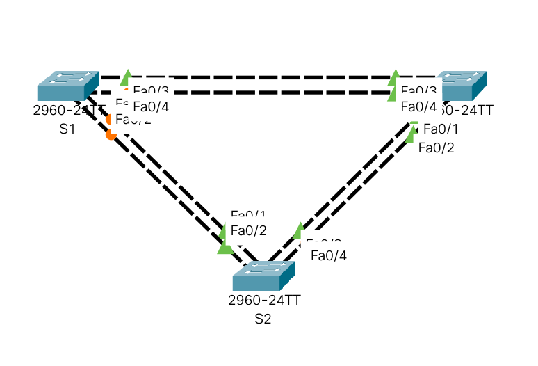
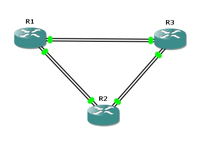
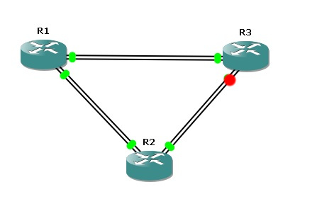
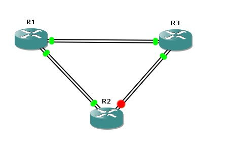

# Лабораторная работа №9. Развертывание коммутируемой сети с резервными каналами (Протокол связующего дерева - STP ).

###  Задание:

1. Создание сети и настройка основных параметров устройств.
2. Определение корневого моста
3. Наблюдение за процессом выбора протоколом STP порта, исходя из стоимости портов
4. Наблюдение за процессом выбора протоколом STP порта, исходя из приоритета портов

## 1. Создание сети и настройка основных параметров устройств.
### 1.1 Создадим топологию данной сети в программе cisco packet tracer в соответсвии с представленной схемой. 




### 1.2. Выполнение базовых настроек коммутаторов (описание только для S1).

```
Switch> enable
Switch#configure terminal
Switch(config)#hostname S1
S1(config)#
```

- Отключение поиска DNS, чтобы предотвратить попытки маршрутизатора неверно преобразовывать введенные команды таким образом, как будто они являются именами узлов.

```
S1(config)#no ip domain-lookup
```

- Создадим пользоваеля admin с паролем cisco в качестве пароля.

```
S1(config)#username admin privilege 0 secret cisco
```


- Настройка использования локальной БД (с ранее заведенными пользвателем admin) для аутентификации доступа в консоль:


```
S1(config)#line console 0
S1(config-line)#login local
S1(config-line)#logging synchronous
S1(config-line)#exit
S1(config)#
```

- Настройка использования локальной БД (с ранее заведенными пользвателем admin) для аутентификации доступа к линиям VTY и отключение доступа к неактивному привилегированному режиму через заданное время:

```
S1(config)#line vty 0 15
S1(config-line)#exec-timeout 5 30
S1(config-line)#login local
S1(config-line)#exit
S1(config)#
```

- Настройка пароля для входа в привилегированный режим и настройка отображения этого пароля в неявном виде при выводе команды **show running-config**

```
S1(config)#enable secret class
S1(config)#service password-encryption
S1(config)#
```

- Настройка приветственного баннера:

```
S1(config)#banner motd $ Vy kto takie! Ya vas ne znayu! Idite naher! $
```

- Настройка и активация на коммутаторе S1 интерфейса VTY:

```
S1(config)#interface vlan 1
S1(config-if)#ip address 192.168.1.1 255.255.255.0
S1(config-if)#no shutdown
S1(config-if)#exit
```

- Сохранение настроенной конфигурации устройства

```
S1#copy running-config startup-config
```
- Проверка доступности всех коммутаторов с S3

Интерфейсы VTY всех коммутаторов доступны.

## 2. Определение корневого моста

### 2.1 Отключение всех портов на коммутаторах (описание только для S1)

```
S1> enable
S1#configure terminal
S1(config)#interface range fastEthernet 0/1 - 24 , GigabitEthernet 0/1 - 2
S1(config-if-range)#shutdown
S1(config-if-range)#exit
S1(config)#
```

### 2.2 Настройка подключенных портов в качестве транковых (описание только для S1)

```
S1(config)#interface range fastEthernet 0/1 - 4
S1(config-if-range)#switchport mode trunk
S1(config-if-range)#switchport trunk allowed vlan 1
S1(config-if-range)#exit
```

### 2.3 Включение портов F0/2 и F0/4 на всех коммутаторах (описание только для S1)
```
S1(config)#interface range fastEthernet 0/2 , fastEthernet 0/4
S1(config-if-range)#no shutdown
S1(config-if-range)#exit
```

### 2.4 Отображение данных протокола spanning-tree.

Вывод команд show spanning-tree на всех коммутаторах:

```
S1#show spanning-tree 
VLAN0001
  Spanning tree enabled protocol ieee
  Root ID    Priority    32769
             Address     0007.ECA5.7C1E
             Cost        19
             Port        4(FastEthernet0/4)
             Hello Time  2 sec  Max Age 20 sec  Forward Delay 15 sec

  Bridge ID  Priority    32769  (priority 32768 sys-id-ext 1)
             Address     00E0.F950.5928
             Hello Time  2 sec  Max Age 20 sec  Forward Delay 15 sec
             Aging Time  20

Interface        Role Sts Cost      Prio.Nbr Type
---------------- ---- --- --------- -------- --------------------------------
Fa0/2            Altn BLK 19        128.2    P2p
Fa0/4            Root FWD 19        128.4    P2p
```

```
S2#show spanning-tree 
VLAN0001
  Spanning tree enabled protocol ieee
  Root ID    Priority    32769
             Address     0007.ECA5.7C1E
             Cost        19
             Port        4(FastEthernet0/4)
             Hello Time  2 sec  Max Age 20 sec  Forward Delay 15 sec

  Bridge ID  Priority    32769  (priority 32768 sys-id-ext 1)
             Address     0009.7C85.BD16
             Hello Time  2 sec  Max Age 20 sec  Forward Delay 15 sec
             Aging Time  20

Interface        Role Sts Cost      Prio.Nbr Type
---------------- ---- --- --------- -------- --------------------------------
Fa0/2            Desg FWD 19        128.2    P2p
Fa0/4            Root FWD 19        128.4    P2p
```

```
S3#show spanning-tree 
VLAN0001
  Spanning tree enabled protocol ieee
  Root ID    Priority    32769
             Address     0007.ECA5.7C1E
             This bridge is the root
             Hello Time  2 sec  Max Age 20 sec  Forward Delay 15 sec

  Bridge ID  Priority    32769  (priority 32768 sys-id-ext 1)
             Address     0007.ECA5.7C1E
             Hello Time  2 sec  Max Age 20 sec  Forward Delay 15 sec
             Aging Time  20

Interface        Role Sts Cost      Prio.Nbr Type
---------------- ---- --- --------- -------- --------------------------------
Fa0/2            Desg FWD 19        128.2    P2p
Fa0/4            Desg FWD 19        128.4    P2p
```

Ответы на вопросы лабраторного задания:

1. Какой коммутатор является корневым мостом?: S3
2. Почему этот коммутатор был выбран протоколом spanning-tree в качестве корневого моста?: У него самое низкое значение MAC-адреса по сравнению с другими коммутаторами.
3. Какие порты на коммутаторе являются корневыми портами?: Для S1 и S2 - Fa0/4, 
4. Какие порты на коммутаторе являются назначенными портами? Для S2 - Fa0/2, для S3 - Fa0/2 и Fa0/4. 
5. Какой порт отображается в качестве альтернативного и в настоящее время заблокирован?: Для S1 - Fa0/2
6. Почему протокол spanning-tree выбрал этот порт в качестве невыделенного (заблокированного) порта?

## 3. Наблюдение за процессом выбора протоколом STP порта, исходя из стоимости портов.

К сожалению в packet tracer не работает изменение стоимости портов.

Но не будем отчаиваться, потому что есть альтернативные среды эмуляции сетевых устройств cisco, среди которых GNS3.

К сожалению, в GNS3, насколько я понимаю нельзя подгрузить нативный образ коммутатора Cisco, например, один из популярных Cisco 2960.

Однако вместо этого можно использовать образ маршрутизатора Cisco 3745 c модулем NM-16ESW c 16 коммутируемыми портами. 

### 3.1 Создание топологии данной сети в программе GNS3 в соответсвии с представленной схемой. 



### 3.3 Команды предварительной настройки маршрутизаторов (описание только для R1).

```
R1#conf t
R1(config)#interface range fa1/0 - 15
R1(config-if-range)#shut 
R1(config-if-range)#exit
R1(config)#interface range fa1/2 , fa1/4
R1(config-if-range)#switchport mode trunk
R1(config-if-range)#no shut
R1(config-if-range)#exit
R1(config)#exit
R1#wr
```
### 3.4 Отображение данных протокола spanning-tree на маршрутизаторах.

```
R1#show spanning-tree

 VLAN1 is executing the ieee compatible Spanning Tree protocol
  Bridge Identifier has priority 32768, address c401.19fc.0000
  Configured hello time 2, max age 20, forward delay 15
  We are the root of the spanning tree
  Topology change flag not set, detected flag not set
  Number of topology changes 2 last change occurred 00:01:03 ago
          from FastEthernet1/2
  Times:  hold 1, topology change 35, notification 2
          hello 2, max age 20, forward delay 15
  Timers: hello 1, topology change 0, notification 0, aging 300

 Port 43 (FastEthernet1/2) of VLAN1 is forwarding
   Port path cost 19, Port priority 128, Port Identifier 128.43.
   Designated root has priority 32768, address c401.19fc.0000
   Designated bridge has priority 32768, address c401.19fc.0000
   Designated port id is 128.43, designated path cost 0
   Timers: message age 0, forward delay 0, hold 0
   Number of transitions to forwarding state: 1
   BPDU: sent 187, received 12

 Port 45 (FastEthernet1/4) of VLAN1 is forwarding
   Port path cost 19, Port priority 128, Port Identifier 128.45.
   Designated root has priority 32768, address c401.19fc.0000
   Designated bridge has priority 32768, address c401.19fc.0000
   Designated port id is 128.45, designated path cost 0
   Timers: message age 0, forward delay 0, hold 0
   Number of transitions to forwarding state: 1
   BPDU: sent 196, received 20
```
```
R2#show spanning-tree

 VLAN1 is executing the ieee compatible Spanning Tree protocol
  Bridge Identifier has priority 32768, address c402.06f0.0000
  Configured hello time 2, max age 20, forward delay 15
  Current root has priority 32768, address c401.19fc.0000
  Root port is 43 (FastEthernet1/2), cost of root path is 19
  Topology change flag not set, detected flag not set
  Number of topology changes 1 last change occurred 00:01:52 ago
          from FastEthernet1/2
  Times:  hold 1, topology change 35, notification 2
          hello 2, max age 20, forward delay 15
  Timers: hello 0, topology change 0, notification 0, aging 300

 Port 43 (FastEthernet1/2) of VLAN1 is forwarding
   Port path cost 19, Port priority 128, Port Identifier 128.43.
   Designated root has priority 32768, address c401.19fc.0000
   Designated bridge has priority 32768, address c401.19fc.0000
   Designated port id is 128.43, designated path cost 0
   Timers: message age 3, forward delay 0, hold 0
   Number of transitions to forwarding state: 1
   BPDU: sent 1, received 71

 Port 45 (FastEthernet1/4) of VLAN1 is forwarding
   Port path cost 19, Port priority 128, Port Identifier 128.45.
   Designated root has priority 32768, address c401.19fc.0000
   Designated bridge has priority 32768, address c402.06f0.0000
   Designated port id is 128.45, designated path cost 19
   Timers: message age 0, forward delay 0, hold 0
   Number of transitions to forwarding state: 1
   BPDU: sent 145, received 14
```
```
R3#show spanning-tree

 VLAN1 is executing the ieee compatible Spanning Tree protocol
  Bridge Identifier has priority 32768, address c403.3750.0000
  Configured hello time 2, max age 20, forward delay 15
  Current root has priority 32768, address c401.19fc.0000
  Root port is 45 (FastEthernet1/4), cost of root path is 19
  Topology change flag not set, detected flag not set
  Number of topology changes 0 last change occurred 00:02:16 ago
  Times:  hold 1, topology change 35, notification 2
          hello 2, max age 20, forward delay 15
  Timers: hello 0, topology change 0, notification 0, aging 300

 Port 43 (FastEthernet1/2) of VLAN1 is blocking
   Port path cost 19, Port priority 128, Port Identifier 128.43.
   Designated root has priority 32768, address c401.19fc.0000
   Designated bridge has priority 32768, address c402.06f0.0000
   Designated port id is 128.45, designated path cost 19
   Timers: message age 4, forward delay 0, hold 0
   Number of transitions to forwarding state: 0
   BPDU: sent 0, received 69

 Port 45 (FastEthernet1/4) of VLAN1 is forwarding
   Port path cost 19, Port priority 128, Port Identifier 128.45.
   Designated root has priority 32768, address c401.19fc.0000
   Designated bridge has priority 32768, address c401.19fc.0000
   Designated port id is 128.45, designated path cost 0
   Timers: message age 2, forward delay 0, hold 0
   Number of transitions to forwarding state: 1
   BPDU: sent 2, received 70
```
Как мы видим, маршрутизатор R1 является корневым. Заблокирован же порт Fa1/2 на маршрутизаторе R3. Изменим стоимость порта Fa1/4 этого же маршрутизатора.

### 3.5 Изменение стоимости порта

```
R3(config)#interface fastEthernet 1/4
R3(config-if)#spanning-tree cost 18
R3(config-if)#exit
```
### 3.6 Повторное отображение данных протокола spanning-tree на маршрутизаторах.

```
R2#show spanning-tree

 VLAN1 is executing the ieee compatible Spanning Tree protocol
  Bridge Identifier has priority 32768, address c402.06f0.0000
  Configured hello time 2, max age 20, forward delay 15
  Current root has priority 32768, address c401.19fc.0000
  Root port is 43 (FastEthernet1/2), cost of root path is 19
  Topology change flag not set, detected flag not set
  Number of topology changes 2 last change occurred 00:36:59 ago
          from FastEthernet1/4
  Times:  hold 1, topology change 35, notification 2
          hello 2, max age 20, forward delay 15
  Timers: hello 0, topology change 0, notification 0, aging 300

 Port 43 (FastEthernet1/2) of VLAN1 is forwarding
   Port path cost 19, Port priority 128, Port Identifier 128.43.
   Designated root has priority 32768, address c401.19fc.0000
   Designated bridge has priority 32768, address c401.19fc.0000
   Designated port id is 128.43, designated path cost 0
   Timers: message age 1, forward delay 0, hold 0
   Number of transitions to forwarding state: 1
   BPDU: sent 4, received 2028

 Port 45 (FastEthernet1/4) of VLAN1 is blocking
   Port path cost 19, Port priority 128, Port Identifier 128.45.
   Designated root has priority 32768, address c401.19fc.0000
   Designated bridge has priority 32768, address c403.3750.0000
   Designated port id is 128.43, designated path cost 18
   Timers: message age 2, forward delay 0, hold 0
   Number of transitions to forwarding state: 1
   BPDU: sent 839, received 1174
```
```
R3#show spanning-tree

 VLAN1 is executing the ieee compatible Spanning Tree protocol
  Bridge Identifier has priority 32768, address c403.3750.0000
  Configured hello time 2, max age 20, forward delay 15
  Current root has priority 32768, address c401.19fc.0000
  Root port is 45 (FastEthernet1/4), cost of root path is 18
  Topology change flag not set, detected flag not set
  Number of topology changes 1 last change occurred 00:38:53 ago
          from FastEthernet1/2
  Times:  hold 1, topology change 35, notification 2
          hello 2, max age 20, forward delay 15
  Timers: hello 0, topology change 0, notification 0, aging 300

 Port 43 (FastEthernet1/2) of VLAN1 is forwarding
   Port path cost 19, Port priority 128, Port Identifier 128.43.
   Designated root has priority 32768, address c401.19fc.0000
   Designated bridge has priority 32768, address c403.3750.0000
   Designated port id is 128.43, designated path cost 18
   Timers: message age 0, forward delay 0, hold 0
   Number of transitions to forwarding state: 1
   BPDU: sent 2384, received 532

 Port 45 (FastEthernet1/4) of VLAN1 is forwarding
   Port path cost 18, Port priority 128, Port Identifier 128.45.
   Designated root has priority 32768, address c401.19fc.0000
   Designated bridge has priority 32768, address c401.19fc.0000
   Designated port id is 128.45, designated path cost 0
   Timers: message age 1, forward delay 0, hold 0
   Number of transitions to forwarding state: 1
   BPDU: sent 1, received 1805
```

Как мы видим, ранее заблокированный порт fa1/2 маршрутизатора R3 разблокировался и стал назначенным. Порт fa1/4 маршрутизатора R2 в этом сетевом сегменте наоборот заблокировался, так как его стоимость стала больше.

Покажем это нагладно.

Заблокированный порт до изменения стоимости:



После:




Вообще, насколько я понимаю, назначенные порты теперь не имеют смысла, так как они использовались для выбора пути пакета в сетевом сегменте (в терминах протокола spanning-tree) на сетевой шине, которая была подключена к разным коммутаторам с двух концов. 

### 3.7 Создание топологии данной сети в программе EVE-NG в соответсвии с представленной схемой. 
Так как использование маршрутизаторов с коммутирующими модулями для имитации коммутаторов было признано читерством, придется выполнить пункт лабораторной еще и в EVE-NG.

Создадим топологию сети:


Настроим линки, соединяющие коммутаторы в режим транка:

```
S1#conf t
S3(config)#interface range ethernet 0/0-3
S3(config-if-range)#shut
S1(config-if-range)#exit
S1(config)#interface range ethernet 0/2-3
S1(config-if-range)#switchport trunk encapsulation dot1q
S1(config-if-range)#switchport mode trunk
S1(config-if-range)#no shut
S1(config-if-range)#exit
S1(config)#exit
R1#wr
```
Текст для вставки в командную строку коммутаторов:

```
enable
conf t
interface range ethernet 0/0-3
shut
exit
interface range ethernet 0/2-3
switchport trunk encapsulation dot1q
switchport mode trunk
no shut
exit
exit
write

```

### 3.8 Отображение данных протокола spanning-tree на маршрутизаторах.

```
S1#show spanning-tree 

VLAN0001
  Spanning tree enabled protocol ieee
  Root ID    Priority    32769
             Address     aabb.cc00.1000
             This bridge is the root
             Hello Time   2 sec  Max Age 20 sec  Forward Delay 15 sec

  Bridge ID  Priority    32769  (priority 32768 sys-id-ext 1)
             Address     aabb.cc00.1000
             Hello Time   2 sec  Max Age 20 sec  Forward Delay 15 sec
             Aging Time  15  sec

Interface           Role Sts Cost      Prio.Nbr Type
------------------- ---- --- --------- -------- --------------------------------
Et0/2               Desg FWD 100       128.3    Shr 
Et0/3               Desg FWD 100       128.4    Shr 
```
```
S2#show spanning-tree 

VLAN0001
  Spanning tree enabled protocol ieee
  Root ID    Priority    32769
             Address     aabb.cc00.1000
             Cost        100
             Port        3 (Ethernet0/2)
             Hello Time   2 sec  Max Age 20 sec  Forward Delay 15 sec

  Bridge ID  Priority    32769  (priority 32768 sys-id-ext 1)
             Address     aabb.cc00.2000
             Hello Time   2 sec  Max Age 20 sec  Forward Delay 15 sec
             Aging Time  15  sec

Interface           Role Sts Cost      Prio.Nbr Type
------------------- ---- --- --------- -------- --------------------------------
Et0/2               Root FWD 100       128.3    Shr 
Et0/3               Desg FWD 100       128.4    Shr 
```
```
S3#show spanning-tree 

VLAN0001
  Spanning tree enabled protocol ieee
  Root ID    Priority    32769
             Address     aabb.cc00.1000
             Cost        100
             Port        4 (Ethernet0/3)
             Hello Time   2 sec  Max Age 20 sec  Forward Delay 15 sec

  Bridge ID  Priority    32769  (priority 32768 sys-id-ext 1)
             Address     aabb.cc00.3000
             Hello Time   2 sec  Max Age 20 sec  Forward Delay 15 sec
             Aging Time  300 sec

Interface           Role Sts Cost      Prio.Nbr Type
------------------- ---- --- --------- -------- --------------------------------
Et0/2               Altn BLK 100       128.3    Shr 
Et0/3               Root LRN 100       128.4    Shr 
```
Как мы видим, заблокирован порт Et0/2 коммутатора S3. 
Изменим его стоимость и посмотрим, как поведет себя протокол spanning-tree:

```
S3(config)#interface ethernet 0/2
S3(config-if)#spanning-tree cost 99
S3(config-if)#exit
```

Теперь посмотрим вывод команды show spanning tree:


## 4. Наблюдение за процессом выбора протоколом STP порта, исходя из приоритета портов.

### 4.1 Включение портов F0/1 и F0/3 на всех коммутаторах

```
S1(config)#interface range fastEthernet 0/1 , fastEthernet 0/3
S1(config-if-range)#no shutdown
S1(config-if-range)#exit
```

### 4.3 Отображение данных протокола spanning-tree.

```
Вывод команд show spanning-tree на всех коммутаторах:

S1#show spanning-tree 
VLAN0001
  Spanning tree enabled protocol ieee
  Root ID    Priority    32769
             Address     0007.ECA5.7C1E
             Cost        19
             Port        3(FastEthernet0/3)
             Hello Time  2 sec  Max Age 20 sec  Forward Delay 15 sec

  Bridge ID  Priority    32769  (priority 32768 sys-id-ext 1)
             Address     00E0.F950.5928
             Hello Time  2 sec  Max Age 20 sec  Forward Delay 15 sec
             Aging Time  20

Interface        Role Sts Cost      Prio.Nbr Type
---------------- ---- --- --------- -------- --------------------------------
Fa0/2            Altn BLK 19        128.2    P2p
Fa0/4            Altn BLK 19        128.4    P2p
Fa0/3            Root FWD 19        128.3    P2p
Fa0/1            Altn BLK 19        128.1    P2p
```

```
S2#show spanning-tree 
VLAN0001
  Spanning tree enabled protocol ieee
  Root ID    Priority    32769
             Address     0007.ECA5.7C1E
             Cost        19
             Port        3(FastEthernet0/3)
             Hello Time  2 sec  Max Age 20 sec  Forward Delay 15 sec

  Bridge ID  Priority    32769  (priority 32768 sys-id-ext 1)
             Address     0009.7C85.BD16
             Hello Time  2 sec  Max Age 20 sec  Forward Delay 15 sec
             Aging Time  20

Interface        Role Sts Cost      Prio.Nbr Type
---------------- ---- --- --------- -------- --------------------------------
Fa0/1            Desg FWD 19        128.1    P2p
Fa0/2            Desg FWD 19        128.2    P2p
Fa0/3            Root FWD 19        128.3    P2p
Fa0/4            Altn BLK 19        128.4    P2p
```

```
S3>en
Password: 
S3#sh
S3#show sp
S3#show spanning-tree 
VLAN0001
  Spanning tree enabled protocol ieee
  Root ID    Priority    32769
             Address     0007.ECA5.7C1E
             This bridge is the root
             Hello Time  2 sec  Max Age 20 sec  Forward Delay 15 sec

  Bridge ID  Priority    32769  (priority 32768 sys-id-ext 1)
             Address     0007.ECA5.7C1E
             Hello Time  2 sec  Max Age 20 sec  Forward Delay 15 sec
             Aging Time  20

Interface        Role Sts Cost      Prio.Nbr Type
---------------- ---- --- --------- -------- --------------------------------
Fa0/1            Desg FWD 19        128.1    P2p
Fa0/2            Desg FWD 19        128.2    P2p
Fa0/3            Desg FWD 19        128.3    P2p
Fa0/4            Desg FWD 19        128.4    P2p
```

Ответы на вопросы лабраторного задания:

1. Какой порт выбран протоколом STP в качестве порта корневого моста на каждом коммутаторе некорневого моста?: На обоих некорневых коммутаторах был выбран порт Fa0/3. Из двух портов, имеющих прямое подключение к корневому коммутатору, был выбран тот, у которого был меньший порядковый номер.
2. Почему протокол STP выбрал эти порты в качестве портов корневого моста на этих коммутаторах?: В случае когда стоимость портов, BID их коммутатора и приоритеты портов равны, выбирается порт меньшим номером.

#### 5. Файл лабораторной работы в программе cisco packet tracer. 


