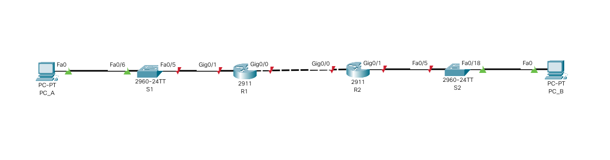

# Занятие №17. Лабораторная работа. Протоколы DHCPv4, SLAAC и DHCPv6.

## 1. Реализация DHCPv4.
###  Задание:

1. Создание сети и настройка основных параметров устройства
2. Настройка и проверка двух серверов DHCPv4 на R1
3. Настройка и проверка DHCP-ретрансляции на R2

### 1.1 Создание сети.

Создадим топологию данной сети в программе cisco packet tracer в соответствии с представленной схемой.



## 1.2 Создание сети.

По условиям задания маршрутизаторам и коммутаторам небходимо выделить адреса в определенных подсетях сети 192.168.1.0/24
1. Подсеть A должна содержать 58 хостов, что соответствует подсети с маской /26, содержащей до 62 хостов.
Параметры подсети: 
- адрес подсети: 192.168.1.0/26 (255.255.255.192)
- первый IP-адрес хоста: 192.168.1.1 
- второй IP-адрес хоста: 192.168.1.2 
- последний IP-адрес хоста: 192.168.1.62 
Интерфейсу R1 G0/0/1.100 необходимо назначить первый адрес, то есть 192.168.1.1 netmask 255.255.255.192. 
Интерфейсу S1 VLAN 100 необходимо назначить второй адрес, то есть 192.168.1.2 netmask 255.255.255.192 gateway 192.168.1.1.  
2. Подсеть B должна содержать 28 хостов, что соответствует подсети с маской /27, содержащей до 30 хостов.
Параметры подсети: 
- адрес подсети: 192.168.1.64/27 (255.255.255.224)
- первый IP-адрес хоста: 192.168.1.65 
- второй IP-адрес хоста: 192.168.1.66 
- последний IP-адрес хоста: 192.168.1.94 
Интерфейсу R1 G0/0/1.200 необходимо назначить первый адрес, то есть 192.168.1.65 netmask 255.255.255.224. 
Интерфейсу S1 VLAN 200 необходимо назначить второй адрес, то есть 192.168.1.66 netmask 255.255.255.224 gateway 192.168.1.65.  
3. Подсеть C должна содержать 12 хостов, что соответствует подсети с маской /28, содержащей до 14 хостов.
Параметры подсети: 
- адрес подсети: 192.168.1.96/28 (255.255.255.240)
- первый IP-адрес хоста: 192.168.1.97
- последний IP-адрес хоста: 192.168.1.110 
Интерфейсу R2 G0/0/1 необходимо назначить первый адрес, то есть 192.168.1.97 netmask 255.255.255.240. 

- 
### 1.2. Выполнение базовых настроек маршрутизаторов (описание только для R1).

- Назначение имени устройства:
```
Router> enable
Router#configure terminal
Router(config)#hostname R1
```

- Отключение поиска DNS, чтобы предотвратить попытки маршрутизатора неверно преобразовывать введенные команды таким образом, как будто они являются именами узлов.

```
R1(config)#no ip domain-lookup
```

- Создадим пользоваеля admin с паролем cisco в качестве пароля.

```
R1(config)#username admin privilege 0 secret cisco
```

- Настройка использования локальной БД (с ранее заведенными пользвателем admin) для аутентификации доступа в консоль:

```
R1(config)#line console 0
R1(config-line)#login local
R1(config-line)#logging synchronous
R1(config-line)#exit
R1(config)#
```

- Настройка использования локальной БД (с ранее заведенными пользвателем admin) для аутентификации доступа к линиям VTY и отключение доступа к неактивному привилегированному режиму через заданное время:

```
R1(config)#line vty 0 15
R1(config-line)#exec-timeout 5 30
R1(config-line)#login local
R1(config-line)#exit
R1(config)#
```

- Настройка пароля для входа в привилегированный режим и настройка отображения этого пароля в неявном виде при выводе команды **show running-config**

```
R1(config)#enable secret class
R1(config)#service password-encryption
R1(config)#
```

- Настройка приветственного баннера:

```
R1(config)#banner motd $ Vy kto takie! Ya vas ne znayu! Idite naher! $
```

- Сохранение настроенной конфигурации устройства

```
R1#copy running-config startup-config
```

Для ускорения настройки соберем все команды в единый блок, который будет вставляться в консоль устройства посредством copy/paste:

```
enable
configure terminal
hostname S2
no ip domain-lookup
username admin privilege 0 secret cisco
line console 0
login local
logging synchronous
exit
line vty 0 15
exec-timeout 5 30
login local
exit
enable secret class
service password-encryption
banner motd $ Vy kto takie! Ya vas ne znayu! Idite naher! $
exit
wr
exit

```

Выполним данный блок на всех маршрутизаторах и коммутаторах нашей сети.

### 1.3. Настройка интерфейсов маршрутизаторов.
- Настроим подинтерфейсы G0/0/1 на маршрутизаторе R1:  

```
R1> enable
R1#configure terminal
R1(config)#interface GigabitEthernet0/1.100
R1(config-subif)#description consumers_vlan
R1(config-subif)#encapsulation dot1Q 100
R1(config-subif)#ip address 192.168.1.1 255.255.255.192
R1(config-subif)#exit
R1(config)#interface GigabitEthernet0/1.200
R1(config-subif)#description network_management_vlan
R1(config-subif)#encapsulation dot1Q 200
R1(config-subif)#ip address 192.168.1.65 255.255.255.224
R1(config-subif)#exit
R1(config)#interface GigabitEthernet0/1.1000
R1(config-subif)#description native_vlan
R1(config-subif)#encapsulation dot1Q 1000 native
R1(config-subif)#exit
```
- Включим родительский интерфейс R1: 

```
R1(config)#interface GigabitEthernet0/1
R1(config-if)#no shutdown
R1(config-if)#exit
R1(config)#exit
R1#wr

```

Блок команд:
```
configure terminal
interface GigabitEthernet0/1.100
description consumers_vlan
encapsulation dot1Q 100
ip address 192.168.1.1 255.255.255.192
exit
interface GigabitEthernet0/1.200
description network_management_vlan
encapsulation dot1Q 200
ip address 192.168.1.65 255.255.255.224
exit
interface GigabitEthernet0/1.1000
description native_vlan
encapsulation dot1Q 1000 native
exit
interface GigabitEthernet0/1
no shutdown
exit
exit
wr
```

- Настроим и включим интерфейс G0/1 на маршрутизаторе R2:
```
R1> enable
R1#configure terminal
R1(config)#interface GigabitEthernet0/1
R1(config-if)#192.168.1.97 netmask 255.255.255.240
R1(config-if)#no shutdown
R1(config-if)#exit
R1(config)#exit
R1#wr

```

Блок команд:

```
configure terminal
interface GigabitEthernet0/1
192.168.1.97 netmask 255.255.255.240
no shutdown
exit
exit
wr
```

### 1.3. Настройка VLAN и интерфесов коммутаторов.

- Настроим VLAN'ы
```
S1> enable
S1#configure terminal
S1(config)#vlan 999
S1(config-vlan)#name parking_lot
S1(config-vlan)vlan 100
S1(config-vlan)#name clients
S1(config-vlan)vlan 200
S1(config-vlan)#name management
S1(config-vlan)vlan 1000
S1(config-vlan)#name native
S1(config-vlan)#exit
```

- Поместим неиспользуемые интерфейсы в vlan 1000 (parking_lot)
```
S1(config)#interface range 
S1(config)#vlan 999
```

- Настроим VLAN'ы и интерфейсы на коммутарое S1:  

```
S1> enable
S1#configure terminal
S1(config)#vlan 999
S1(config-vlan)#name parking_lot
S1(config-vlan)vlan 100
S1(config-vlan)#name clients
S1(config-vlan)vlan 200
S1(config-vlan)#name management
S1(config-vlan)vlan 1000
S1(config-vlan)#name native
S1(config-vlan)#exit
S1(config)#interface fa0/6
S1(config-if)#description client_pc_a
S1(config-if)#switchport mode access
S1(config-if)#switchport access vlan 200
S1(config-if)#interface fa0/5
S1(config-if)#description trunk_to_r1
S1(config-if)#switchport mode trunk
S1(config-if)#switchport trunk allowed vlan 100,200,1000
S1(config-if)#switchport access vlan 1000 native


```


#### 5. Файл лабораторной работы в программе cisco packet tracer. 


