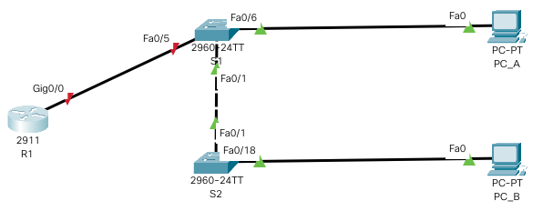

# Занятие №20. Лабораторная работа. Принципы обеспечения безопасности сети.

###  Задание:

1. Настройка основного сетевого устройства.
2. Настройка сетей VLAN.
3. Настройки безопасности коммутатора.

## 1. Создание сети и настройка параметров устройств.
### 1.1 Создание сети.

Создадим топологию данной сети в программе cisco packet tracer в соответствии с представленной схемой.



### 1.2 Настройка маршрутизатора R1.

- Исключение двух диапазонов IP-адресов из выдачи DHCP-сервера:
```
R1(config)#ip dhcp excluded-address 192.168.10.1 192.168.10.9
R1(config)#ip dhcp excluded-address 192.168.10.201 192.168.10.202
```
- Настройка DHCP-пула:
```
R1(config)#ip dhcp pool Students
R1(dhcp-config)#network 192.168.10.0 255.255.255.0
R1(dhcp-config)#default-router 192.168.10.1
R1(dhcp-config)#domain-name CCNA2.Lab-11.6.1
```
- Настройка loopback интерфейса:
```
R1(config)#interface Loopback0
R1(config-if)#ip address 10.10.1.1 255.255.255.0
```
- Настройка интерфейса GigabitEthernet0/0/1:
```
R1(config)#interface GigabitEthernet0/0/1
R1(config-if)#description Link to S1
R1(config-if)#ip dhcp relay information trusted
R1(config-if)#ip address 192.168.10.1 255.255.255.0
R1(config-if)#no shutdown
```
*Примечание: команда ip dhcp не реализована в Packet Tracer

### 1.3 Настройка коммутаторов.

- Добавление необходимых VLAN на коммутаторы S1 и S2 (показано для S1, для S2 аналогично)
```
S1#conf t
S1(config)#vlan 10
S1(config-vlan)#name Management
S1(config)#vlan 333
S1(config-vlan)#name Native
S1(config)#vlan 999
S1(config-vlan)#name ParkingLot
```
- Настройка интерфеса SVI на VLAN 10 коммутаторов S1 и S2
```
S1(config)#interface vlan 10
S1(config-if)#ip address 192.168.10.201 255.255.255.0
S1(config-if)#exit
S1(config)#ip default-gateway 192.168.10.1
```
```
S2(config)#interface vlan 10
S2(config-if)#ip address 192.168.10.202 255.255.255.0
S2(config-if)#exit
S2(config)#ip default-gateway 192.168.10.1
```

