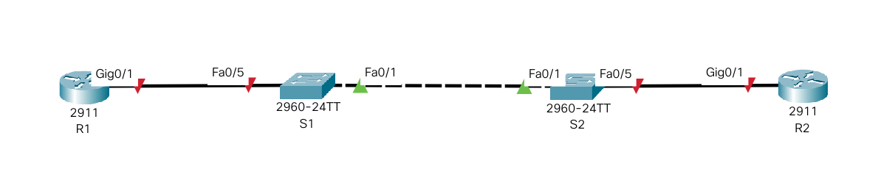

# Лабораторная работа. Настройка протокола OSPFv2 для одной области.

##  Задание:

1. Создание сети и настройка основных параметров устройства
2. Настройка и проверка базовой работы протокола  OSPFv2 для одной области
3. Оптимизация и проверка конфигурации OSPFv2 для одной области

##  Решение:

### 1. Создание сети и настройка основных параметров устройств.

#### 1.1 Создадим топологию данной сети в программе cisco packet tracer. 



#### 1.2. Выполнение базовых настроек маршрутизаторов и коммутаторов (описание только для R1).

- Назначение имени устройства:
```
Router> enable
Router#configure terminal
Router(config)#hostname R1
```

- Отключение поиска DNS, чтобы предотвратить попытки маршрутизатора неверно преобразовывать введенные команды таким образом, как будто они являются именами узлов.

```
R1(config)#no ip domain-lookup
```

- Создадим пользоваеля admin с паролем cisco в качестве пароля.

```
R1(config)#username admin privilege 0 secret cisco
```

- Настройка использования локальной БД (с ранее заведенными пользвателем admin) для аутентификации доступа в консоль:

```
R1(config)#line console 0
R1(config-line)#login local
R1(config-line)#logging synchronous
R1(config-line)#exit
R1(config)#
```

- Настройка использования локальной БД (с ранее заведенными пользвателем admin) для аутентификации доступа к линиям VTY и отключение доступа к неактивному привилегированному режиму через заданное время:

```
R1(config)#line vty 0 15
R1(config-line)#exec-timeout 5 30
R1(config-line)#login local
R1(config-line)#exit
R1(config)#
```

- Настройка пароля для входа в привилегированный режим и настройка отображения этого пароля в неявном виде при выводе команды **show running-config**

```
R1(config)#enable secret class
R1(config)#service password-encryption
R1(config)#
```

- Настройка приветственного баннера:

```
R1(config)#banner motd $ Vy kto takie! Ya vas ne znayu! Idite naher! $
```

- Сохранение настроенной конфигурации устройства

```
R1#copy running-config startup-config
```

Для ускорения настройки соберем все команды в единый блок, который будет вставляться в консоль устройства посредством copy/paste:

```
enable
configure terminal
hostname S2
no ip domain-lookup
username admin privilege 0 secret cisco
line console 0
login local
logging synchronous
exit
line vty 0 15
exec-timeout 5 30
login local
exit
enable secret class
service password-encryption
banner motd $ Vy kto takie! Ya vas ne znayu! Idite naher! $
exit
wr
exit

```

Выполним данный блок на всех маршрутизаторах и коммутаторах нашей сети.
