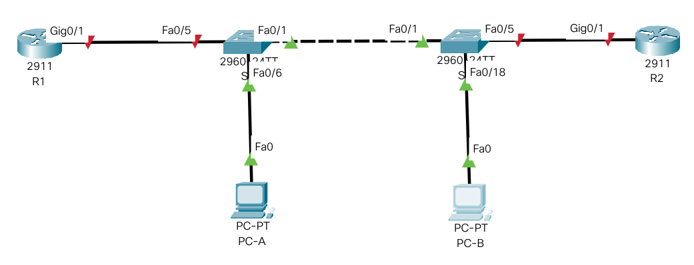
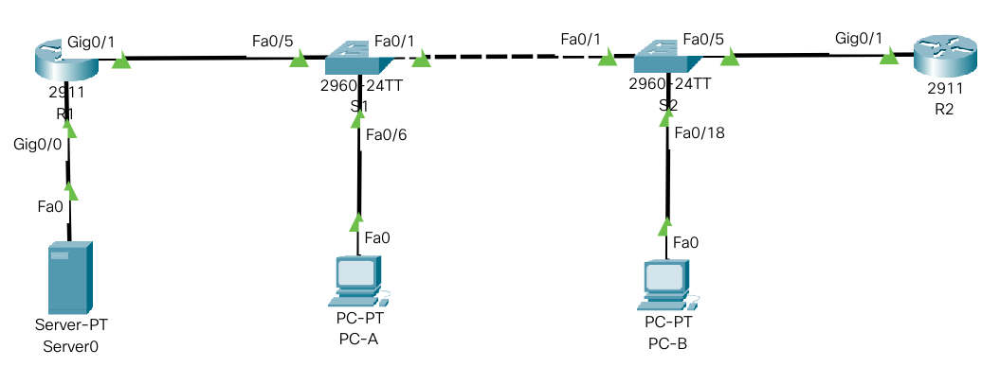

# Лабораторная работа. Настройка и проверка расширенных списков контроля доступа.

##  Задание:
1. Создание сети и настройка основных параметров устройства
2. Настройка VLAN и интерфейсов коммутаторов
3. Настройка интерфейсов маршрутизаторов
4. Натсройка SSH на маршрутизаторе R1
5. Настройка и проверка списков расширенного контроля доступа

##  Решение:

### 1. Создание сети и настройка основных параметров устройств.

#### 1.1 Создадим топологию данной сети в программе cisco packet tracer. 



#### 1.2. Выполнение базовых настроек маршрутизаторов и коммутаторов (описание только для R1).

- Назначение имени устройства:
```
Router> enable
Router#configure terminal
Router(config)#hostname R1
```

- Отключение поиска DNS, чтобы предотвратить попытки маршрутизатора неверно преобразовывать введенные команды таким образом, как будто они являются именами узлов.

```
R1(config)#no ip domain-lookup
```

- Создадим пользоваеля admin с паролем cisco в качестве пароля.

```
R1(config)#username admin privilege 0 secret cisco
```

- Настройка использования локальной БД (с ранее заведенными пользвателем admin) для аутентификации доступа в консоль:

```
R1(config)#line console 0
R1(config-line)#login local
R1(config-line)#logging synchronous
R1(config-line)#exit
R1(config)#
```

- Настройка использования локальной БД (с ранее заведенными пользвателем admin) для аутентификации доступа к линиям VTY и отключение доступа к неактивному привилегированному режиму через заданное время:

```
R1(config)#line vty 0 15
R1(config-line)#exec-timeout 5 30
R1(config-line)#login local
R1(config-line)#exit
R1(config)#
```

- Настройка пароля для входа в привилегированный режим и настройка отображения этого пароля в неявном виде при выводе команды **show running-config**

```
R1(config)#enable secret class
R1(config)#service password-encryption
R1(config)#
```

- Настройка приветственного баннера:

```
R1(config)#banner motd $ Vy kto takie! Ya vas ne znayu! Idite naher! $
```

- Сохранение настроенной конфигурации устройства

```
R1#copy running-config startup-config
```

Для ускорения настройки соберем все команды в единый блок, который будет вставляться в консоль устройства посредством copy/paste:

```
enable
configure terminal
hostname S2
no ip domain-lookup
username admin privilege 0 secret cisco
line console 0
login local
logging synchronous
exit
line vty 0 15
exec-timeout 5 30
login local
exit
enable secret class
service password-encryption
banner motd $ Vy kto takie! Ya vas ne znayu! Idite naher! $
exit
wr
exit
```

Выполним данный блок на всех маршрутизаторах и коммутаторах нашей сети.

### 2. Настройка VLAN и интерфейсов устройств

#### 2.1. Настройка VLAN
- Создадим необходимые VLAN (показано для S1, на S2 аналогично)
```
S1#conf t
S1(config)#vlan 20
S1(config-vlan)#name Management
S1(config)#vlan 30
S1(config-vlan)#name Operaions
S1(config)#vlan 40
S1(config-vlan)#name Sales
S1(config)#vlan 999
S1(config-vlan)#name ParkingLot
S1(config)#vlan 1000
S1(config-vlan)#name Native
```

#### 2.2.  Назначения VLAN интерфейсам S1 и S2.

- Внесение всех портов в ParkingLot и их выключение.

*Примечание: удобнее сначала внести все порты в ParkingLot, а потом перенастроить нужные - меньше возни с диапазонами.

```
S1(config)#interface range fa0/1 - 24, Gi0/1 - 2
S1(config-if)#switchport mode access
S1(config-if)#switchport access vlan 999
S1(config-if)#shut
```
- Внесение портов в нужные VLAN на S1
```
S1(config)#interface fa0/6
S1(config-if)#switchport access vlan 30
S1(config-if)#no shut
```
- Аналогично на S2
```
S2(config)#interface fa0/5
S2(config-if)#switchport access vlan 20
S2(config-if)#no shut
S2(config)#interface fa0/18
S2(config-if)#switchport access vlan 40
S2(config-if)#no shut
```

- Настройка интерфеса SVI в Management VLAN коммутаторов S1 и S2
```
S1(config)#interface vlan 20
S1(config-if)#ip address 10.20.0.2 255.255.255.0
S1(config-if)#exit
S1(config)#ip default-gateway 10.20.0.1
```

```
S2(config)#interface vlan 20
S2(config-if)#ip address 10.20.0.3 255.255.255.0
S2(config-if)#exit
S2(config)#ip default-gateway 10.20.0.1
```

- Настройка транковых портов коммутаторов S1 и S2
```
S1(config)#interface range fa0/1, fa0/5
S1(config-if)#switchport mode trunk
S1(config-if)#switchport trunk allowed vlan 20,30,40,1000
S1(config-if)#switchport trunk native vlan 1000
S1(config-if)#no shut
```
```
S2(config)#interface range fa0/1
S2(config-if)#switchport mode trunk
S2(config-if)#switchport trunk allowed vlan 20,30,40,1000
S2(config-if)#switchport trunk native vlan 1000
S1(config-if)#no shut
```
- Проверка выполненных настроек

show interfaces trunk

### 3. Настройка интерфейсов маршрутизаторов

#### 3.1. Настройка маршрутизатора R1 как router-on-stick.
```
R1(config)#interface GigabitEthernet0/1.20
R1(config-subif)#description network_management_vlan
R1(config-subif)#encapsulation dot1Q 20
R1(config-subif)#ip address 10.20.0.1 255.255.255.0
R1(config-subif)#exit
R1(config)#interface GigabitEthernet0/1.30
R1(config-subif)#description operations_vlan
R1(config-subif)#encapsulation dot1Q 30
R1(config-subif)#ip address 10.30.0.1 255.255.255.0
R1(config-subif)#exit
R1(config)#interface GigabitEthernet0/1.40
R1(config-subif)#description sales_vlan
R1(config-subif)#encapsulation dot1Q 40
R1(config-subif)#ip address 10.40.0.1 255.255.255.0
R1(config-subif)#exit
R1(config)#interface GigabitEthernet0/1.1000
R1(config-subif)#description native_vlan
R1(config-subif)#encapsulation dot1Q 1000 native
R1(config-subif)#exit
R1(config)#interface loopback1
R1(config-subif)#description loopback
R1(config-subif)#ip address 172.16.1.1 255.255.255.0
R1(config-subif)#no shut
R1(config-subif)#exit
R1(config)#interface GigabitEthernet0/1
R1(config-if)#no sh
R1(config-if)#end
```
#### 3.2. Настройка маршрутизатора R2.

```
R2(config)#interface GigabitEthernet0/1
R2(config-if)#ip address 10.20.0.4 255.255.255.0
R2(config-if)#no sh
R2(config-if)#exit
R2(config-if)#ip route 0.0.0.0 0.0.0.0 10.20.0.1
R2(config-if)#end
```

### 4. Настройка SSH на маршрутизаторе R1

- Создадим пользователя для удаленного доступа по SSH
```
R1(config)#username SSHadmin privilege 15 secret $cisco123!
```
- Зададим доменное имя устройства
```
R1#configure terminal
R1(config)#ip domain-name ccna-lab.com
```
- Сгенерируем ключ шифрования с длиной 1024 бита.
```
R1(config)#crypto key generate rsa general-keys modulus 1024
```
- Включаем SSH сервер v2 на R1
```
R1(config)#ip ssh version 2
```
- Активируем доступ по протоколу SSH на линиях VTY:
```
R1(config)#line vty 0 5 
R1(config-line)#transport input ssh
R1(config-line)#login local
```

### 5. Включение службы HTTP на маршрутизаторе R1
```
R1(config)#ip http secure-server
R1(config)#ip http authentication local
```
*Примечание: команда ip http не реализована в packet tracer.

Нужно что-то придумывать...Подключим к интерфейсу G0/0 R1 сервер PT.
Топология сети станет следующей:




Установим на Сервере адрес 192.168.0.2 255.255.255.0 и настроим маршрутизатор:

```
R1(config)#interface g0/0
R1(config-if)#ip address 192.168.0.1 255.255.255.0
R1(config-if)#no sh
```

### 6. Настройка PC-A и PC-B

Настроим хосты в соответствии с заданием

### 7. Проверка подключений

### 8. Настройка и проверка списков расширенного контроля доступа

По условиям задания необходимо реализовать 5 политик безопасности. Так как доступ из одной сети в другую может осуществляться только через подинтерфейсы маршрутизатора R1, то и все списки доступа будем настраивать на нем.

#### 8.1. Политика 1

*Политика 1. Сеть Sales не может использовать SSH в сети Management (но в  другие сети SSH разрешен).*


Маршрутизация в сеть Management (10.20.0.0/24) происходит через подинтерфейс GigabitEthernet0/1.20, в сеть Sales (10.40.0.0/24) через GigabitEthernet0/1.40.

Следовательно нужно создать access-list, запрещающий пакеты с ip источника, соответствующего диапазону сети Sales (10.40.0.0/24), ip назначения, соответствующего диапазону сети Management (10.20.0.0/24), протоколом tcp и портом 22. И затем применить его на интерфейсе GigabitEthernet0/1.40 для входящего траффика.  

Это самый оптимальный для ресурсов маршрутизатора вариант (хоть и не самый логичный), потому что тогда запрещенные пакеты будут отбрасываться еще на этапе прихода на маршрутизатор и не проходить дальше.

Зачем проверять ip источника на соответствие сети Sales, если мы применяем правило на подинтерфейс, который на нее уже настроен и по идее оттуда ничего, кроме пакетов с IP источника этой сети, прийти не может. Но вдруг в этом VLAN есть некий еще один маршрутизатор, который пересылает в него траффик другой сети.

```
R1(config)#ip access-list extended DENY_SSH_FROM_SALES_TO_MANAGEMENT
R1(config-std-nacl)#deny tcp 10.40.0.0 0.0.0.255 10.20.0.0 0.0.0.255 eq 22
R1(config-std-nacl)#permit any any
R1(config)#GigabitEthernet0/1.40
R1(config-if)#ip access-group DENY_SSH_FROM_SALES_TO_MANAGEMENT in
```

Проверка настроенных правил: до применения правил от PC-B, включенного в сеть Sales (10.40.0.10) ping и ssh до 10.20.0.1 проходят, после применения проходит только ping.

```
R1#show access-lists 
Extended IP access list DENY_SSH_FROM_SALES_TO_MANAGEMENT
    10 deny tcp 10.40.0.0 0.0.0.255 10.20.0.0 0.0.0.255 eq 22 (12 match(es))
    20 permit ip any any (4 match(es))
```

Как видно из вывода команды, ACL сработал.

#### 8.1. Политика 2

*Политика 2. Сеть Sales не имеет доступа к IP-адресам в сети Management с помощью любого веб-протокола (HTTP/HTTPS). Сеть Sales также не имеет доступа к интерфейсам R1 с помощью любого веб-протокола. Разрешён весь другой веб-трафик (обратите внимание — Сеть Sales  может получить доступ к интерфейсу Loopback 1 на R1).*

Нужно создать access-list с первым правилом, запрещающим пакеты с ip источника, соответствующего диапазону сети Sales (10.40.0.0/24), ip назначения, соответствующего диапазону сети Management (10.20.0.0/24), протоколом tcp и портами 80 и 443. И затем применить его на интерфейсе GigabitEthernet0/1.40 для входящего траффика. Второе правило будет запрещать пакеты к хосту 10.20.0.1 по протоколу tcp и портам 80 и 443. Третье правило будет запрещать пакеты к хосту 10.30.0.1 по протоколу tcp и портам 80 и 443. Четвертое правило будет запрещать пакеты к хосту 10.40.0.1 по протоколу tcp и портам 80 и 443.

Перед применением правила, нужно отключить применение старого правила, для чего выполним команду no ip access-group.
```
R1(config)#ip access-list extended DENY_HTTP_HTTPS_FROM_SALES_TO_MANAGEMENT_AND_R1
R1(config-std-nacl)#deny tcp 10.40.0.0 0.0.0.255 10.20.0.0 0.0.0.255 eq 80
R1(config-std-nacl)#deny tcp 10.40.0.0 0.0.0.255 10.20.0.0 0.0.0.255 eq 443
R1(config-std-nacl)#deny tcp any host 10.20.0.1 eq 80
R1(config-std-nacl)#deny tcp any host 10.20.0.1 eq 443
R1(config-std-nacl)#deny tcp any host 10.30.0.1 eq 80
R1(config-std-nacl)#deny tcp any host 10.30.0.1 eq 443
R1(config-std-nacl)#deny tcp any host 10.40.0.1 eq 80
R1(config-std-nacl)#deny tcp any host 10.40.0.1 eq 443
R1(config-std-nacl)#permit any any
R1(config)#GigabitEthernet0/1.40
R1(config-if)#no ip access-group
R1(config-if)#ip access-group DENY_HTTP_HTTPS_FROM_SALES_TO_MANAGEMENT_AND_R1 in
```

#### 8.1. Политика 3

*Политика3. Сеть Sales не может отправлять эхо-запросы ICMP в сети Operations или Management. Разрешены эхо-запросы ICMP к другим адресатам.*

Нужно создать access-list с первым правилом, запрещающим пакеты с ip источника, соответствующего диапазону сети Sales (10.40.0.0/24), ip назначения, соответствующего диапазону сети Management (10.20.0.0/24), протоколом icmp. Второе правило будет запрещать пакеты с ip источника, соответствующего диапазону сети Sales (10.40.0.0/24), ip назначения, соответствующего диапазону сети Operations (10.30.0.0/24) и протоколом icmp.
И затем применить его на интерфейсе GigabitEthernet0/1.40 для входящего траффика.

```
R1(config)#ip access-list extended DENY_ICMP_FROM_SALES_TO_MANAGEMENT_AND_OPERATIONS
R1(config-std-nacl)#deny icmp 10.40.0.0 0.0.0.255 10.20.0.0 0.0.0.255
R1(config-std-nacl)#deny icmp 10.40.0.0 0.0.0.255 10.30.0.0 0.0.0.255
R1(config-std-nacl)#permit any any
R1(config)#GigabitEthernet0/1.40
R1(config-if)#no ip access-group
R1(config-if)#ip access-group DENY_ICMP_FROM_SALES_TO_MANAGEMENT_AND_OPERATIONS in
```
#### 8.1. Политика 4

*Политика 4: Cеть Operations  не может отправлять ICMP эхозапросы в сеть Sales. Разрешены эхо-запросы ICMP к другим адресатам.*

Нужно создать access-list с правилом, запрещающим пакеты с ip источника, соответствующего диапазону сети Operations (10.30.0.0/24), ip назначения, соответствующего диапазону сети Sales (10.40.0.0/24), протоколом icmp.
И затем применить его на интерфейсе GigabitEthernet0/1.30 для входящего траффика.

```
R1(config)#ip access-list extended DENY_ICMP_FROM_OPERATIONS_TO_SALES
R1(config-std-nacl)#deny icmp 10.30.0.0 0.0.0.255 10.40.0.0 0.0.0.255
R1(config-std-nacl)#permit any any
R1(config)#GigabitEthernet0/1.30
R1(config-if)#ip access-group DENY_ICMP_FROM_OPERATIONS_TO_SALES in
```
