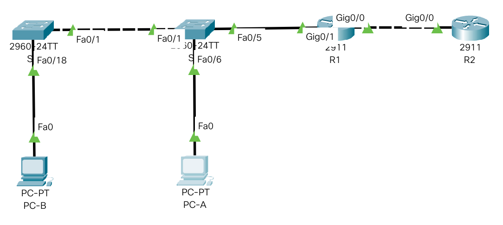

# Лабораторная работа. Настройка NAT для IPv4.

1. Создание сети и настройка начальных параметров устройств
2. Настройка интерфейсов маршрутизаторов и коммутаторов
3. Настройка и проверка NAT для IPv4
4. Настройка и проверка PAT для IPv4
5. Настройка и проверка статического NAT для IPv4.

### 1. Создание сети и настройка основных параметров устройств.

#### 1.1 Создадим топологию данной сети в программе cisco packet tracer. 



#### 1.2. Выполнение базовых настроек маршрутизаторов и коммутаторов (описание только для R1).

- Назначение имени устройства:
```
Router> enable
Router#configure terminal
Router(config)#hostname R1
```

- Отключение поиска DNS, чтобы предотвратить попытки маршрутизатора неверно преобразовывать введенные команды таким образом, как будто они являются именами узлов.

```
R1(config)#no ip domain-lookup
```

- Создадим пользоваеля admin с паролем cisco в качестве пароля.

```
R1(config)#username admin privilege 0 secret cisco
```

- Настройка использования локальной БД (с ранее заведенными пользвателем admin) для аутентификации доступа в консоль:

```
R1(config)#line console 0
R1(config-line)#login local
R1(config-line)#logging synchronous
R1(config-line)#exit
R1(config)#
```

- Настройка использования локальной БД (с ранее заведенными пользвателем admin) для аутентификации доступа к линиям VTY и отключение доступа к неактивному привилегированному режиму через заданное время:

```
R1(config)#line vty 0 15
R1(config-line)#exec-timeout 5 30
R1(config-line)#login local
R1(config-line)#exit
R1(config)#
```

- Настройка пароля для входа в привилегированный режим и настройка отображения этого пароля в неявном виде при выводе команды **show running-config**

```
R1(config)#enable secret class
R1(config)#service password-encryption
R1(config)#
```

- Настройка приветственного баннера:

```
R1(config)#banner motd $ Vy kto takie! Ya vas ne znayu! Idite naher! $
```

- Сохранение настроенной конфигурации устройства

```
R1#copy running-config startup-config
```

Для ускорения настройки соберем все команды в единый блок, который будет вставляться в консоль устройства посредством copy/paste:

```
enable
configure terminal
hostname S2
no ip domain-lookup
username admin privilege 0 secret cisco
line console 0
login local
logging synchronous
exit
line vty 0 15
exec-timeout 5 30
login local
exit
enable secret class
service password-encryption
banner motd $ Vy kto takie! Ya vas ne znayu! Idite naher! $
exit
wr
exit
```
## 2. Настройка интерфейсов маршрутизаторов и коммутаторов

## 2.1. Настройка маршрутизатора R2

```
R2(config)#interface g0/0
R2(config-if)#ip address 209.165.200.225 255.255.255.248
R2(config-if)#no sh
R2(config)#interface loopback 1
R2(config-if)#ip address 209.165.200.1 255.255.255.224
R2(config-if)#no sh
```

## 2.2. Настройка маршрутизатора R1

```
R1(config)#interface g0/0
R1(config-if)#ip address 209.165.200.230 255.255.255.248
R1(config-if)#no sh
R1(config)#interface g0/1
R1(config-if)#ip address 192.168.1.1 255.255.255.0
R1(config-if)#no sh
```

Обязательно нужно настроить статический маршрут до сети, в которой настроен loopback интерфейс маршрутизатора R2, иначе до него не будет связности с маршрутизатора R1:

```
R1(config)#ip route 209.165.200.0 255.255.255.224 209.165.200.225
```

## 2.3. Настройка коммутатора S1

```
S1(config)#interface vlan 1
S1(config-if)#ip address 192.168.1.11 255.255.255.0
S1(config-if)#no sh
```

## 2.4. Настройка коммутатора S2

```
S2(config)#interface vlan 1
S2(config-if)#ip address 192.168.1.12 255.255.255.0
S2(config-if)#no sh
```

# 3. Настройка и проверка динамического NAT

- Сначала нужно определить диапазон адресов, подлежащих трансляции с помощью стандартной ACL:
```
R1(config)#ip access-list standard LOCAL_NET
R1(config-std-nacl)#permit 192.168.1.0 0.0.0.255
```
- Затем нужно настроить пул глобальных адресов
```
R1(config)#ip nat pool GLOBAL_POOL 209.165.200.226 209.165.200.228 netmask 255.255.255.248
```
- Затем добавляем правило трансляции
```
R1(config)#ip nat inside source list LOCAL_NET pool GLOBAL_POOL
```
- И наконец включаем NAT-трансляцию на интерфейсах
```
R1(config)#interface GigabitEthernet0/1
R1(config)#ip nat inside
R1(config)#interface GigabitEthernet0/0
R1(config)#ip nat outside
```
- Проверяем результаты работы NAT
```
R1#show ip nat translations 
Pro  Inside global     Inside local       Outside local      Outside global
icmp 209.165.200.226:53192.168.1.3:53     209.165.200.1:53   209.165.200.1:53
icmp 209.165.200.226:54192.168.1.3:54     209.165.200.1:54   209.165.200.1:54
icmp 209.165.200.226:55192.168.1.3:55     209.165.200.1:55   209.165.200.1:55
icmp 209.165.200.226:56192.168.1.3:56     209.165.200.1:56   209.165.200.1:56
icmp 209.165.200.226:57192.168.1.3:57     209.165.200.1:57   209.165.200.1:57
icmp 209.165.200.226:58192.168.1.3:58     209.165.200.1:58   209.165.200.1:58
```

Как мы видим, локальный внутренний адрес PC-B 192.168.1.3 преобразовался в глобальный внутренний адрес 209.165.200.226 и пакет был смаршрутизирован на R2, так как R1 имеет статический маршрут до адресата, то есть Loopback интерфейса R2 209.165.200.1.
