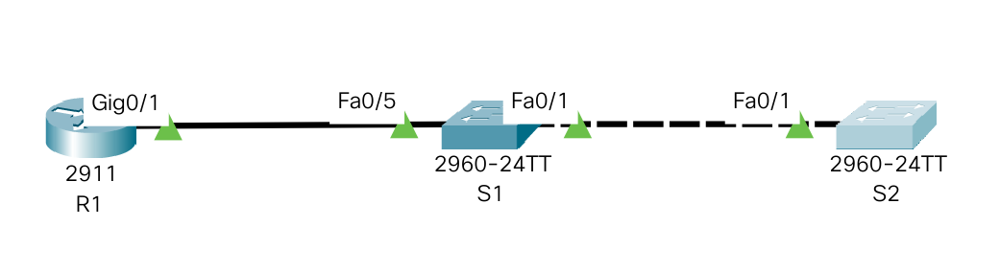

# Лабораторная работа. Настройка протоколов CDP, LLDP и NTP.

1. Создание сети и настройка основных параметров устройств
2. Настройка интерфейсов маршрутизаторов и коммутаторов
3. Обнаружение сетевых ресурсов с помощью протокола CDP
4. Обнаружение сетевых ресурсов с помощью протокола LLDP
5. Настройка и проверка NTP

## 1. Создание сети и настройка основных параметров устройств.

### 1.1 Создадим топологию данной сети в программе cisco packet tracer. 



### 1.2. Выполнение базовых настроек маршрутизаторов и коммутаторов (описание только для R1).

- Назначение имени устройства:
```
Router> enable
Router#configure terminal
Router(config)#hostname R1
```

- Отключение поиска DNS, чтобы предотвратить попытки маршрутизатора неверно преобразовывать введенные команды таким образом, как будто они являются именами узлов.

```
R1(config)#no ip domain-lookup
```

- Создадим пользоваеля admin с паролем cisco в качестве пароля.

```
R1(config)#username admin privilege 0 secret cisco
```

- Настройка использования локальной БД (с ранее заведенными пользвателем admin) для аутентификации доступа в консоль:

```
R1(config)#line console 0
R1(config-line)#login local
R1(config-line)#logging synchronous
R1(config-line)#exit
R1(config)#
```

- Настройка использования локальной БД (с ранее заведенными пользвателем admin) для аутентификации доступа к линиям VTY и отключение доступа к неактивному привилегированному режиму через заданное время:

```
R1(config)#line vty 0 15
R1(config-line)#exec-timeout 5 30
R1(config-line)#login local
R1(config-line)#exit
R1(config)#
```

- Настройка пароля для входа в привилегированный режим и настройка отображения этого пароля в неявном виде при выводе команды **show running-config**

```
R1(config)#enable secret class
R1(config)#service password-encryption
R1(config)#
```

- Настройка приветственного баннера:

```
R1(config)#banner motd $ Vy kto takie! Ya vas ne znayu! Idite naher! $
```

- Сохранение настроенной конфигурации устройства

```
R1#copy running-config startup-config
```

Для ускорения настройки соберем все команды в единый блок, который будет вставляться в консоль устройства посредством copy/paste:

```
enable
configure terminal
hostname S2
no ip domain-lookup
username admin privilege 0 secret cisco
line console 0
login local
logging synchronous
exit
line vty 0 15
exec-timeout 5 30
login local
exit
enable secret class
service password-encryption
banner motd $ Vy kto takie! Ya vas ne znayu! Idite naher! $
exit
wr
exit
```
## 2. Настройка интерфейсов маршрутизаторов и коммутаторов


### 2.1. Настройка маршрутизатора R1

```
R1(config)#interface g0/1
R1(config-if)#ip address 10.22.0.1 255.255.255.0
R1(config-if)#no sh
R1(config)#interface loopback 1
R1(config-if)#ip address 172.16.1.1 255.255.255.0
R1(config-if)#no sh

```

### 2.2. Настройка коммутатора S1

```
S1(config)#interface vlan 1
S1(config-if)#ip address 10.22.0.2 255.255.255.0
S1(config-if)#no sh
S1(config)#ip default-gateway 10.22.0.1
```

### 2.3. Настройка коммутатора S2

```
S2(config)#interface vlan 1
S2(config-if)#ip address 10.22.0.3 255.255.255.0
S2(config-if)#no sh
S2(config)#ip default-gateway 10.22.0.1
```

## 3. Обнаружение сетевых ресурсов с помощью протокола CDP

- Проверим, на скольких интерфейсах включено CDP:

```
R1#show cdp interface 
Vlan1 is administratively down, line protocol is down
  Sending CDP packets every 60 seconds
  Holdtime is 180 seconds
GigabitEthernet0/0 is administratively down, line protocol is down
  Sending CDP packets every 60 seconds
  Holdtime is 180 seconds
GigabitEthernet0/1 is up, line protocol is up
  Sending CDP packets every 60 seconds
  Holdtime is 180 seconds
GigabitEthernet0/2 is administratively down, line protocol is down
  Sending CDP packets every 60 seconds
  Holdtime is 180 seconds
```
Как мы видим, CDP включен на всех интерфейсах. 

- Посмотрим обнаруженных соседей:
```
R1#show cdp neighbors 
Capability Codes: R - Router, T - Trans Bridge, B - Source Route Bridge
                  S - Switch, H - Host, I - IGMP, r - Repeater, P - Phone
Device ID    Local Intrfce   Holdtme    Capability   Platform    Port ID
S1           Gig 0/1          134            S       2960        Fas 0/5
```
Как мы видим, к порту Fa 0/5 подключен коммутатор S1.

- Посмотрим детальную информацию о нем:
```
R1#show cdp entry S1

Device ID: S1
Entry address(es): 
  IP address : 10.22.0.2
Platform: cisco 2960, Capabilities: Switch
Interface: GigabitEthernet0/1, Port ID (outgoing port): FastEthernet0/5
Holdtime: 154

Version :
Cisco IOS Software, C2960 Software (C2960-LANBASE-M), Version 12.2(25)FX, RELEASE SOFTWARE (fc1)
Copyright (c) 1986-2005 by Cisco Systems, Inc.
Compiled Wed 12-Oct-05 22:05 by pt_team

advertisement version: 2
Duplex: full
```
- Отключим CDP на всех устройствах (показано для R1, для остальных аналогично)
```
R1(config)#no cdp run 
```
## 3. Обнаружение сетевых ресурсов с помощью протокола LLDP

- Включим LLDP на устройствах (показано для R1, для остальных аналогично)
```
R1(config)#lldp run
```

- Посмотрим обнаруженных соседей:
```
R1#show lldp neighbors 
Capability codes:
    (R) Router, (B) Bridge, (T) Telephone, (C) DOCSIS Cable Device
    (W) WLAN Access Point, (P) Repeater, (S) Station, (O) Other
Device ID           Local Intf     Hold-time  Capability      Port ID
S1                  Gig0/1         120        B               Fa0/5

Total entries displayed: 1
```
- Посмотрим детальную информацию о них:
```
R1#show lldp neighbors detail 
------------------------------------------------
Chassis id: 0060.3EBE.5005
Port id: Fa0/5
Port Description: FastEthernet0/5
System Name: S1
System Description:
Cisco IOS Software, C2960 Software (C2960-LANBASE-M), Version 12.2(25)FX, RELEASE SOFTWARE (fc1)
Copyright (c) 1986-2005 by Cisco Systems, Inc.
Compiled Wed 12-Oct-05 22:05 by pt_team
Time remaining: 90 seconds
System Capabilities: B
Enabled Capabilities: B
Management Addresses - not advertised
Auto Negotiation - supported, enabled
Physical media capabilities:
    100baseT(FD)
    100baseT(HD)
    1000baseT(HD)
Media Attachment Unit type: 10
Vlan ID: 1

Total entries displayed: 1
```
